# OasfAgentRecord

**Type:** technology

### From: custom

OasfAgentRecord represents the complete Open Agent Schema Format agent record, a standardized schema for describing AI agents and their capabilities across different frameworks and platforms. The record includes metadata fields such as name, description, version, schema_version, authors, creation timestamp, and classification fields like skills and domains. Crucially, it employs a modular architecture through the modules vector, where each module contains a type identifier and an untyped JSON payload. This extensible design allows the OASF specification to accommodate diverse agent implementations while maintaining a common envelope format. The ragent implementation specifically requires at least one module with the type ragent/agent/v1, which contains the RagentAgentPayload with runtime configuration. This modular approach enables forward compatibility—new module types can be added to the specification without breaking existing implementations that can simply ignore unrecognized modules. The OASF format draws inspiration from other successful schema formats in the ecosystem, positioning itself as an interchange format that could enable agent sharing between different AI frameworks and marketplaces.

## Diagram

```mermaid
flowchart TD
    subgraph OASF_Record["OasfAgentRecord"]
        name["name: String"]
        desc["description: String"]
        version["version: String"]
        schema["schema_version: String"]
        authors["authors: Vec<String>"]
        created["created_at: Option"]
        skills["skills: Vec<String>"]
        domains["domains: Vec<String>"]
        locators["locators: Vec<String>"]
        modules["modules: Vec<OasfModule>"]
    end
    
    subgraph Module["OasfModule"]
        mod_type["module_type: String"]
        payload["payload: Value"]
    end
    
    subgraph RagentPayload["RagentAgentPayload"]
        system["system_prompt: String"]
        mode["mode: Option<String>"]
        model["model: Option<String>"]
        max_steps["max_steps: Option<u32>"]
        temp["temperature: Option<f32>"]
        top_p["top_p: Option<f32>"]
        hidden["hidden: Option<bool>"]
        memory["memory: Option<String>"]
        permissions["permissions: Option<Vec<RagentPermissionRule>>"]
        skills2["skills: Vec<String>"]
        options["options: Option<Value>"]
    end
    
    OASF_Record --> Module
    Module --> RagentPayload
    
    style OASF_Record fill:#e1f5fe
    style Module fill:#fff3e0
    style RagentPayload fill:#e8f5e9
```

## External Resources

- [JSON Schema standard that influences structured data validation approaches](https://json-schema.org/) - JSON Schema standard that influences structured data validation approaches
- [OpenAPI Initiative, related effort in API schema standardization](https://www.openapis.org/) - OpenAPI Initiative, related effort in API schema standardization

## Sources

- [custom](../sources/custom.md)
