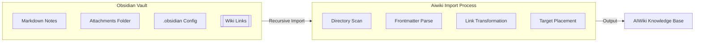

# Obsidian

**Type:** product

### From: aiwiki_import

Obsidian is a powerful knowledge base application that operates on top of a local folder of plain text Markdown files, developed by Dynalist founders Shida Li and Erica Xu and first released in 2020. Unlike traditional note-taking applications that store content in proprietary databases or cloud services, Obsidian uses a decentralized vault architecture where each vault is simply a directory containing markdown files with optional YAML frontmatter metadata. This design philosophy of local-first, future-proof storage has made Obsidian extremely popular among researchers, writers, and knowledge workers who value data ownership and long-term accessibility.

The platform has evolved into a comprehensive personal knowledge management ecosystem through its extensive plugin architecture and active community. Obsidian supports sophisticated linking patterns including wiki-style [[links]], block references, and graph visualization of note relationships. These features enable the creation of dense, interconnected knowledge networks often referred to as "digital gardens" or "second brains." The application's graph view provides visual exploration of note relationships, while its backlinking system automatically surfaces connections between related concepts.

The AiwikiImportTool's explicit mention of Obsidian vault import support indicates a deliberate design decision to accommodate the large existing ecosystem of Obsidian users and their content. Obsidian vaults often contain thousands of interconnected notes with specific conventions around file organization, attachment handling, and metadata. By supporting Obsidian vault structures, the AIWiki system can ingest not just isolated documents but entire curated knowledge bases with their internal link structures preserved. This capability is particularly valuable for AI agents working with domain experts who have invested significant effort in organizing their knowledge in Obsidian.

## Diagram

## External Resources

- [Official Obsidian website and download](https://obsidian.md/) - Official Obsidian website and download
- [Obsidian Help Documentation](https://help.obsidian.md/Home) - Obsidian Help Documentation
- [Obsidian GitHub organization with plugin APIs](https://github.com/obsidianmd) - Obsidian GitHub organization with plugin APIs

## Sources

- [aiwiki_import](../sources/aiwiki-import.md)
