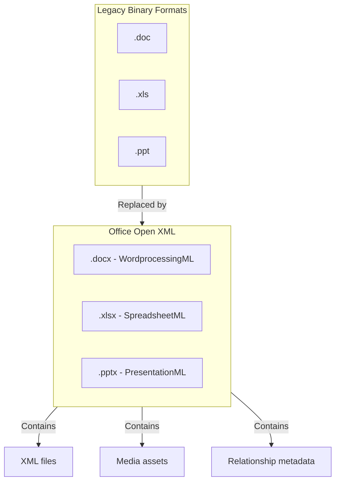

# Office Open XML (OOXML)

**Type:** technology

### From: office_common

Office Open XML, commonly abbreviated as OOXML, is a zipped, XML-based file format developed by Microsoft for representing office documents. It was standardized by Ecma International as ECMA-376 in 2006 and later by ISO/IEC as ISO/IEC 29500 in 2008. This format represents a significant departure from the legacy binary formats used in older versions of Microsoft Office, offering improved interoperability, reduced file corruption risk, and easier programmatic manipulation. The three primary OOXML formats are WordprocessingML (.docx) for word processing documents, SpreadsheetML (.xlsx) for spreadsheets, and PresentationML (.pptx) for presentations. These formats are essentially ZIP archives containing XML files, media assets, and relationship metadata that together represent the document structure and content.

The adoption of OOXML marked a major transition in the office software ecosystem. Prior to OOXML, Microsoft Office used proprietary binary formats (.doc, .xls, .ppt) that were difficult for third-party applications to read and write reliably. The XML-based approach of OOXML enables better data recovery, as individual components can often be extracted even if the file becomes corrupted. It also facilitates interoperability with other software systems and enables server-side processing of documents without requiring Microsoft Office to be installed. The format specification is openly documented, though implementation remains complex due to the extensive feature set and some legacy compatibility considerations embedded in the standard.

OOXML has become the de facto standard for office documents in enterprise and government environments, particularly following mandates in various jurisdictions requiring open document standards for official records. The format continues to evolve with new versions of Microsoft Office, with each release extending the specification to support new features while maintaining backward compatibility. The strict separation of content, formatting, and metadata in OOXML files makes them particularly well-suited for automated processing, content extraction, and transformation workflows, which is the primary use case addressed by the code in this module.

## Diagram

## External Resources

- [ECMA-376 Office Open XML File Formats standard](https://www.ecma-international.org/publications-and-standards/standards/ecma-376/) - ECMA-376 Office Open XML File Formats standard
- [Wikipedia article on Office Open XML](https://en.wikipedia.org/wiki/Office_Open_XML) - Wikipedia article on Office Open XML
- [Microsoft Open Specifications for OOXML](https://learn.microsoft.com/en-us/openspecs/office_standards/ms-ooxml) - Microsoft Open Specifications for OOXML

## Sources

- [office_common](../sources/office-common.md)
