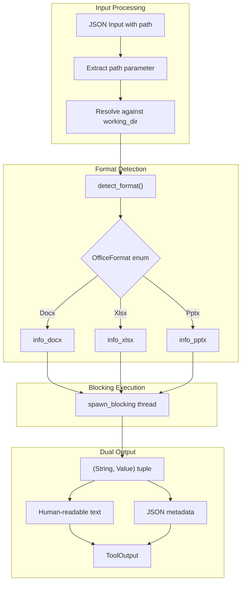

# OfficeInfoTool

**Type:** technology

### From: office_info

OfficeInfoTool is a Rust struct implementing the Tool trait that serves as the primary interface for extracting metadata from Microsoft Office documents. It represents a concrete implementation in the ragent-core framework, designed to be instantiated and executed within an agent-based system where tools perform discrete operations on behalf of an AI agent. The struct itself is a zero-sized type (unit struct), with all functionality implemented through the Tool trait methods.

The tool is registered with the name "office_info" and requires a single "path" parameter pointing to the target Office document. It operates within the "file:read" permission category, indicating its read-only nature. The execute method orchestrates the extraction workflow: resolving relative paths against a working directory, detecting the file format through extension analysis, gathering basic file metadata (size), and delegating to format-specific extraction functions running in blocking threads.

A key architectural strength is the dual-output design where each extraction produces both human-readable formatted text for display to end users and machine-readable JSON metadata for programmatic consumption. This design supports both interactive use cases where users need quick document summaries and automated workflows requiring structured data processing.

## Diagram

## External Resources

- [Tokio spawn_blocking documentation for CPU-bound async operations](https://docs.rs/tokio/latest/tokio/task/fn.spawn_blocking.html) - Tokio spawn_blocking documentation for CPU-bound async operations
- [Serde serialization framework for JSON handling in Rust](https://serde.rs/) - Serde serialization framework for JSON handling in Rust

## Sources

- [office_info](../sources/office-info.md)
