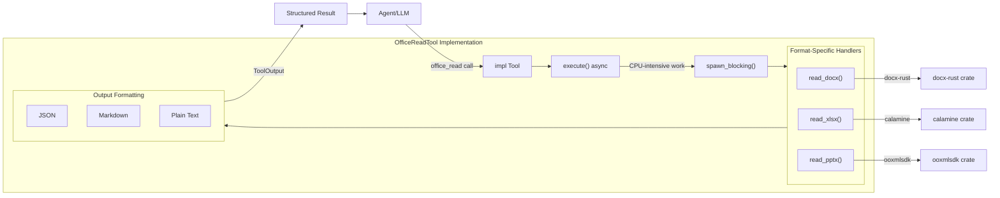

# OfficeReadTool

**Type:** technology

### From: office_read

OfficeReadTool is a Rust struct that implements the `Tool` trait, serving as the primary interface for reading Microsoft Office documents in the ragent framework. This tool abstracts the complexity of working with three distinct Office formats—Word, Excel, and PowerPoint—behind a unified API that accepts parameters for file path, output format, and format-specific options like Excel sheet names or PowerPoint slide numbers. The struct itself is a zero-sized type (unit struct) that relies entirely on its trait implementation to provide functionality, demonstrating efficient Rust design patterns for stateless utilities.

The tool's implementation spans approximately 400 lines of code and delegates to specialized internal functions for each Office format. It supports three output formats: plain text for simple extraction, markdown for readable formatted documents with preserved structure, and JSON for programmatic consumption. The tool is designed with LLM consumption as a primary use case, ensuring that extracted content is structured in ways that facilitate reasoning and analysis by AI systems. Security considerations are embedded through the "file:read" permission category, requiring explicit authorization before document access.

OfficeReadTool demonstrates sophisticated async Rust patterns by using `tokio::task::spawn_blocking` to offload CPU-intensive document parsing from the async runtime. This prevents blocking the event loop while parsing potentially large Office documents, which may involve substantial decompression and XML processing. The tool also implements output truncation to prevent overly large documents from overwhelming LLM context windows, showing awareness of practical deployment constraints in agent systems.

## Diagram

## External Resources

- [docx-rust crate documentation for Word document parsing](https://docs.rs/docx-rust/latest/docx_rust/) - docx-rust crate documentation for Word document parsing
- [calamine crate documentation for Excel spreadsheet reading](https://docs.rs/calamine/latest/calamine/) - calamine crate documentation for Excel spreadsheet reading
- [Office Open XML format specification (ISO/IEC 29500)](https://en.wikipedia.org/wiki/Office_Open_XML) - Office Open XML format specification (ISO/IEC 29500)

## Sources

- [office_read](../sources/office-read.md)
