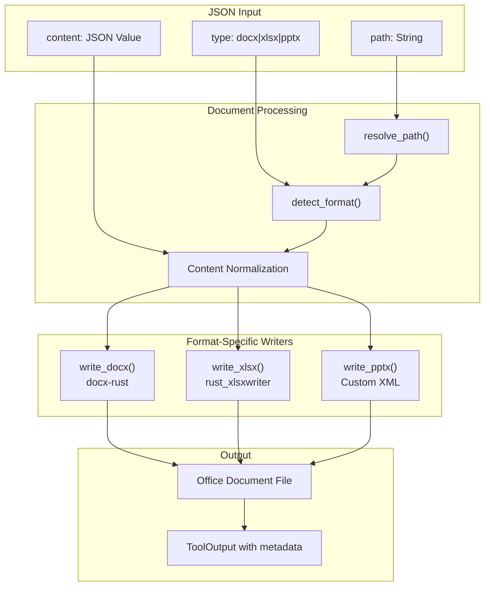

# OfficeWriteTool

**Type:** technology

### From: office_write

OfficeWriteTool is a Rust struct that serves as the primary interface for creating Microsoft Office documents from structured JSON content. As an implementation of the `Tool` trait, it provides a standardized way for agent systems to generate Word, Excel, and PowerPoint files programmatically. The tool's architecture reflects careful consideration of the unpredictable nature of LLM outputs, incorporating multiple content shape normalizers that can handle various JSON structures. For example, when processing Word documents, it gracefully accepts content as a direct array of elements, an object containing a `paragraphs` array, or an object with a `content` array. This flexibility is crucial in production environments where language models may produce inconsistently structured responses. The tool implements async execution through Tokio's spawn_blocking mechanism, ensuring that file I/O operations don't block the async runtime. Its parameter schema, returned as JSON, describes the expected input format including path, document type, optional title, and content structure. The permission category of "file:write" indicates its capability to modify the filesystem, requiring appropriate security considerations in deployment.

## Diagram

## External Resources

- [docx-rust crate for Word document generation](https://crates.io/crates/docx-rust) - docx-rust crate for Word document generation
- [rust_xlsxwriter crate for Excel file creation](https://crates.io/crates/rust_xlsxwriter) - rust_xlsxwriter crate for Excel file creation
- [async_trait documentation for trait async methods](https://docs.rs/async-trait/latest/async_trait/) - async_trait documentation for trait async methods

## Sources

- [office_write](../sources/office-write.md)
