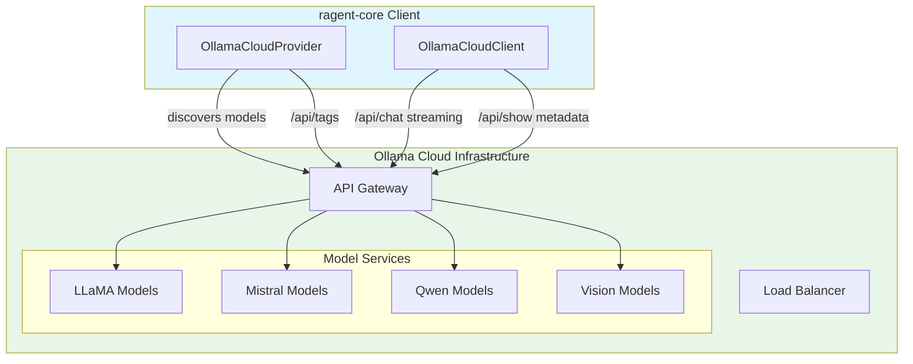

# Ollama Cloud

**Type:** product

### From: ollama_cloud

Ollama Cloud is the managed, cloud-hosted version of Ollama, a popular open-source tool for running large language models locally. While the original Ollama project focuses on local execution of models on personal hardware, Ollama Cloud extends this to a scalable infrastructure-as-a-service model. The platform provides API access to a curated selection of open-weight models including Llama, Mistral, Gemma, and Qwen families, eliminating the need for users to manage their own GPU infrastructure. Ollama Cloud maintains API compatibility with the open-source Ollama REST API, using endpoints like `/api/chat`, `/api/tags`, and `/api/show` for model operations.

The service uses bearer token authentication and supports both synchronous and streaming response modes. A distinctive feature of the Ollama protocol is its native support for multimodal inputs, where images are passed as separate base64-encoded arrays rather than embedded in message content. The platform has gained traction among developers who want the simplicity of Ollama's API design with the reliability and scale of managed infrastructure. Ollama Cloud competes in the same space as other model hosting services like Together AI, Fireworks, and Groq, but distinguishes itself through its focus on open-source model weights and the ability to run identical models locally and in the cloud.

The implementation in this source file reveals several Ollama Cloud-specific behaviors: the requirement for API keys on all requests, the use of POST requests to `/api/show` for model metadata retrieval, and the specific JSON schema for tool calling where function arguments are passed as objects rather than strings. The platform's vision support is indicated through a `capabilities` array in model responses, and thinking/reasoning content (exposed by models like Qwen3) appears in a dedicated `thinking` field in message responses.

## Diagram

## External Resources

- [Official Ollama Cloud website and documentation](https://ollama.com/) - Official Ollama Cloud website and documentation
- [Ollama REST API specification](https://github.com/ollama/ollama/blob/main/docs/api.md) - Ollama REST API specification

## Sources

- [ollama_cloud](../sources/ollama-cloud.md)
