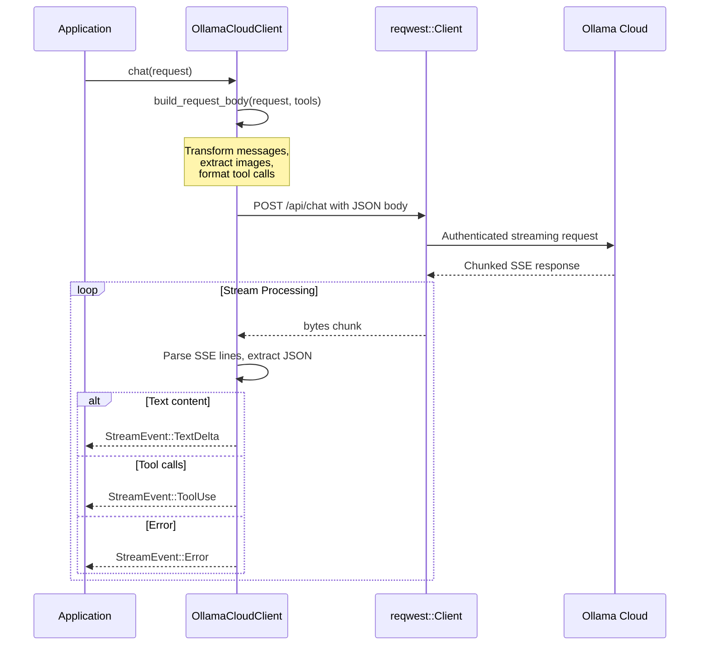

# OllamaCloudClient

**Type:** technology

### From: ollama_cloud

The `OllamaCloudClient` struct represents the runtime HTTP client for communicating with Ollama Cloud's chat API. It encapsulates the authenticated session state including the API key, base URL, and an underlying `reqwest::Client` configured for streaming responses. This struct implements the `LlmClient` trait, providing the core `chat` method that transforms high-level `ChatRequest` objects into HTTP requests and streams back `StreamEvent` responses. The design follows the async Rust pattern with `Pin<Box<dyn Stream>>` return types, enabling efficient memory usage for long-running streaming conversations without blocking execution.

The client's most complex functionality resides in `build_request_body`, which performs sophisticated message format translation from the ragent-core internal representation to Ollama's native protocol. This translation handles several Ollama-specific requirements: converting structured message parts (text, images, tool uses, tool results) into Ollama's expected JSON schema; stripping data-URL prefixes from base64 images to extract raw data for Ollama's separate `images` array; and mapping tool calling conventions where Ollama expects `tool_calls` with `function.name` and `function.arguments` (with arguments as objects, not strings). The method also maintains a `tool_id_to_name` mapping to support Ollama's use of `name` rather than `tool_call_id` in tool result messages, ensuring compatibility while preserving the original tool identification from the request.

The streaming implementation in `chat` uses `async_stream::stream!` to yield events as they arrive from the chunked HTTP response. It handles Server-Sent Events (SSE) parsing, JSON extraction from `data:` prefixed lines, and proper timeout management with stall detection. The stream processor maintains state for open tool calls and yields appropriate `StreamEvent` variants including `TextDelta` for content and `Error` for failures. Special handling exists for diagnostic logging of stream events, with thinking/reasoning content from models like Qwen3 being detected and logged separately from main content.

## Diagram

## External Resources

- [reqwest HTTP client library for Rust](https://docs.rs/reqwest/latest/reqwest/) - reqwest HTTP client library for Rust
- [async-stream for creating async iterators](https://docs.rs/async-stream/latest/async_stream/) - async-stream for creating async iterators

## Sources

- [ollama_cloud](../sources/ollama-cloud.md)
