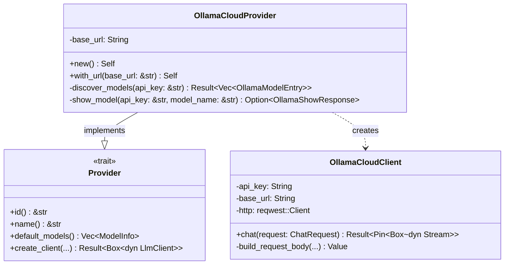

# OllamaCloudProvider

**Type:** technology

### From: ollama_cloud

The `OllamaCloudProvider` struct serves as the main entry point and configuration object for Ollama Cloud integration within the ragent-core framework. As an implementation of the `Provider` trait, it fulfills the framework's contract for LLM provider discovery, client creation, and metadata provision. The struct maintains minimal state—only a `base_url` string—allowing it to be lightweight and easily instantiated. The default URL points to `https://ollama.com`, the official Ollama Cloud endpoint, but the `with_url` constructor enables customization for private deployments or alternative hosts that expose an Ollama-compatible API.

The provider's primary responsibilities include model enumeration through the `discover_models` method, which queries the `/api/tags` endpoint to retrieve all models accessible to the authenticated user. This method implements proper error handling with the `anyhow` crate, converting HTTP failures and JSON parsing errors into descriptive context messages. For each discovered model, the provider can fetch extended metadata via `show_model`, which calls the `/api/show` endpoint to retrieve architecture details, context window sizes, and capability flags. These two methods work in concert to populate `ModelInfo` structures that the ragent framework uses for model selection and capability checking.

The `create_client` method materializes the provider configuration into an operational `OllamaCloudClient`, performing validation that an API key is present (Ollama Cloud requires authentication unlike some other providers). The provider also implements sensible defaults for context window estimation through the `estimate_context_window` function, which uses heuristics based on parameter size strings like "7B" or "70B" to infer appropriate token limits when the API doesn't provide explicit values. This estimation logic reflects real-world patterns where larger parameter models typically support larger context windows, with thresholds at 7B, 30B, and 70B parameters mapping to 8K, 32K, 65K, and 128K token windows respectively.

## Diagram

## External Resources

- [anyhow error handling library for Rust](https://docs.rs/anyhow/latest/anyhow/) - anyhow error handling library for Rust

## Sources

- [ollama_cloud](../sources/ollama-cloud.md)
