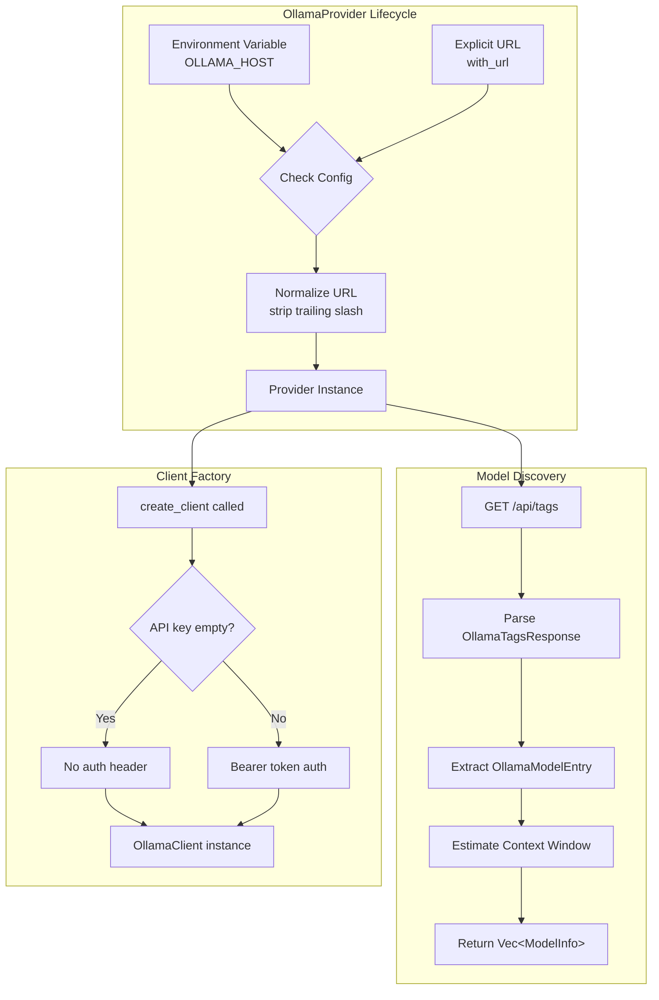

# OllamaProvider

**Type:** technology

### From: ollama

The `OllamaProvider` struct is the core configuration and factory component within the ragent-core crate's provider architecture, implementing the `Provider` trait to enable seamless integration with Ollama servers. This struct encapsulates the connection parameters and lifecycle management for Ollama instances, serving as the entry point for creating executable LLM clients. The provider pattern employed here follows a separation of concerns where configuration (the provider) is distinct from execution (the client), allowing for flexible resource management and connection pooling strategies.

The implementation demonstrates sophisticated configuration discovery mechanisms. When instantiated via `new()`, the provider first checks for the `OLLAMA_HOST` environment variable, falling back to a sensible default of `http://localhost:11434` which corresponds to Ollama's standard port. This environment-aware initialization supports development workflows where developers may have Ollama running on non-standard ports or remote machines. The `with_url()` constructor provides explicit programmatic control, enabling runtime configuration based on user preferences or service discovery systems. Both constructors normalize URLs by stripping trailing slashes, preventing common URL construction bugs.

A key distinguishing feature of this provider is its support for dynamic model discovery through the `discover_models()` method. Unlike providers for commercial APIs that maintain static model lists, Ollama's model availability depends entirely on what the user has pulled locally. The provider queries Ollama's `/api/tags` endpoint to enumerate available models at runtime, parsing response structures like `OllamaTagsResponse` and `OllamaModelEntry`. This enables applications to present accurate model selectors and validate configurations against actual server state. The provider also implements intelligent context window estimation based on parameter size strings (like "70B" or "8B"), mapping these to appropriate token limits without requiring explicit configuration.

## Diagram

## Sources

- [ollama](../sources/ollama.md)
