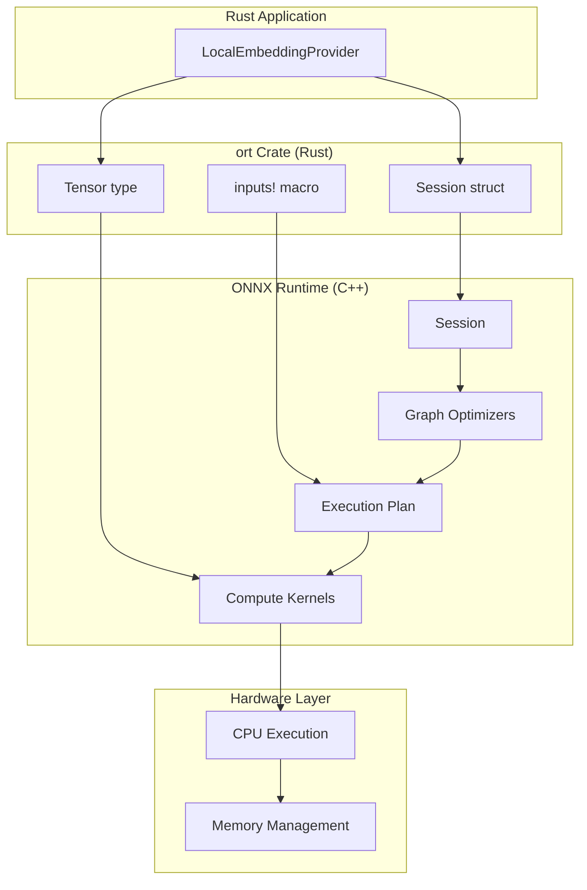

# ONNX Runtime

**Type:** technology

### From: local

ONNX Runtime is an open-source inference engine developed by Microsoft that enables high-performance execution of machine learning models in the Open Neural Network Exchange (ONNX) format. Originally released in 2018, ONNX Runtime has become one of the most widely deployed inference solutions, supporting execution across diverse hardware targets including CPUs, GPUs, and specialized accelerators like Intel OpenVINO and NVIDIA TensorRT. The runtime achieves performance through sophisticated graph optimizations, kernel fusion, and hardware-specific execution providers that can dramatically reduce latency compared to naive implementations. For the Rust ecosystem, the `ort` crate provides idiomatic bindings to the native ONNX Runtime C++ libraries, enabling safe and efficient model inference without Python dependencies.

The architecture of ONNX Runtime centers on a Session abstraction that represents a loaded model with optimized execution plans. When a model is loaded, the runtime performs extensive graph-level optimizations including constant folding, operator fusion, and layout transformations to produce an execution plan tailored to the target hardware. The Session API in Rust (`ort::session::Session`) follows a builder pattern where users configure execution providers, threading options, and memory optimization settings before committing to a loaded model. This design allows fine-grained control over inference behavior while maintaining safety through Rust's ownership system. The runtime supports both imperative execution for single inferences and optimized batching for throughput-critical applications.

In the LocalEmbeddingProvider implementation, ONNX Runtime serves as the core inference engine that executes the transformer model's forward pass. The integration demonstrates several production patterns: session creation through `Session::builder()`, model loading via `commit_from_file()`, and tensor-based I/O using the `ort::value::Tensor` abstraction. The runtime handles the complex transformer computations including multi-head self-attention, feed-forward networks, and layer normalization, exposing only the high-level tensor interface. This abstraction is crucial for embedding applications where users need reliable semantic vectors without managing the substantial complexity of transformer implementation details. The choice of ONNX Runtime over alternatives like TensorFlow Lite or PyTorch Mobile reflects its superior cross-platform support, mature Rust bindings, and optimization capabilities for transformer architectures.

## Diagram

## External Resources

- [Official ONNX Runtime project website with documentation and release notes](https://onnxruntime.ai/) - Official ONNX Runtime project website with documentation and release notes
- [Rust crate 'ort' providing safe bindings to ONNX Runtime](https://crates.io/crates/ort) - Rust crate 'ort' providing safe bindings to ONNX Runtime
- [Microsoft's official ONNX Runtime GitHub repository](https://github.com/microsoft/onnxruntime) - Microsoft's official ONNX Runtime GitHub repository

## Sources

- [local](../sources/local.md)
