# ooxmlsdk

**Type:** technology

### From: office_info

ooxmlsdk is a Rust crate providing strongly-typed access to Office Open XML (OOXML) document structures, with particular strength in PowerPoint (.pptx) parsing. Unlike simpler crates that offer surface-level APIs, ooxmlsdk generates Rust types from the actual OOXML schemas, resulting in exhaustive representations of the specification including presentation structure, slide layouts, shapes, text bodies, and drawing elements. This schema-derived approach ensures compatibility with the full complexity of real-world PowerPoint files.

The OfficeInfoTool leverages ooxmlsdk in the `info_pptx` function, which demonstrates the crate's deeply nested type hierarchy. The entry point is `PresentationDocument::new_from_file()`, which parses the presentation package and exposes `presentation_part.slide_parts`—a vector of individual slide representations. Each slide contains a `root_element` with `children` representing different slide content choices, navigated through pattern matching on enums like `SlideChildChoice::PCSld` (common slide data).

The title extraction logic reveals ooxmlsdk's granularity: slide titles are found by traversing `shape_tree.children`, matching `ShapeTreeChildChoice::PSp` (shape), checking for `text_body`, then iterating through `a_p` (paragraph) elements and their `children` as `ParagraphChildChoice::AR` (text run) variants to accumulate `xml_content`. This level of detail captures PowerPoint's flexible text placement (titles can exist in any shape, not just designated title placeholders) but requires familiarity with OOXML's conceptual model. The crate's generated types mirror the XML schema closely, making the API predictable for developers familiar with the underlying specification.

## Diagram

```mermaid
flowchart LR
    subgraph Entry["Document Entry"]
        A["PresentationDocument::new_from_file"]
    end
    
    subgraph Navigation["Slide Navigation"]
        A --> B["presentation_part"]
        B --> C["slide_parts: Vec"]
        C --> D["Enumerate slides"]
    end
    
    subgraph DeepTraversal["Title Extraction Traversal"]
        D --> E["root_element.children"]
        E -->|SlideChildChoice::PCSld| F["common_slide_data"]
        F --> G["shape_tree.children"]
        G -->|ShapeTreeChildChoice::PSp| H["shape"]
        H --> I["text_body?"]
        I --> J["a_p paragraphs"]
        J -->|ParagraphChildChoice::AR| K["text run"]
        K --> L["xml_content"]
    end
    
    subgraph Accumulation["Result Building"]
        L --> M["Accumulate title text"]
        M --> N["slide_titles vector"]
    end
```

## External Resources

- [ooxmlsdk crate on crates.io](https://crates.io/crates/ooxmlsdk) - ooxmlsdk crate on crates.io
- [ooxmlsdk API documentation](https://docs.rs/ooxmlsdk/latest/ooxmlsdk/) - ooxmlsdk API documentation
- [ECMA-376 Office Open XML standard specification](https://www.ecma-international.org/publications-and-standards/standards/ecma-376/) - ECMA-376 Office Open XML standard specification

## Sources

- [office_info](../sources/office-info.md)

### From: office_read

ooxmlsdk is a Rust library providing comprehensive access to Office Open XML (OOXML) document parts through strongly-typed schemas, specifically used in this implementation for PowerPoint (.pptx) parsing. Unlike higher-level libraries that abstract presentation structure, ooxmlsdk exposes the underlying XML schema types defined in the ECMA-376 standard, enabling precise traversal of presentation documents including slides, shape trees, text bodies, and notes slides. This low-level access is necessary for accurate extraction of title placeholders, body text, and speaker notes that might be missed by simpler text extraction approaches.

The office_read.rs integration demonstrates sophisticated use of ooxmlsdk's generated schema types from namespaces like `schemas_openxmlformats_org_presentationml_2006_main`. The code navigates presentation structure through `PresentationDocument::new_from_file`, accesses slide parts through `presentation_part.slide_parts`, and extracts content by matching on schema enums like `SlideChildChoice` and `ShapeTreeChildChoice`. The `extract_slide_text` function implements heuristics for identifying title shapes by checking `PlaceholderValues` in application non-visual drawing properties, distinguishing titles from other text elements based on PowerPoint's internal placeholder classification system.

ooxmlsdk's design reflects the complexity of the PowerPoint format, which stores slides as collections of shapes within group shapes, each containing text bodies with paragraph and run-level formatting. This schema-level access enables extraction of speaker notes through `notes_slide_part` relationships, a feature often missing from simpler PowerPoint readers. The library's type safety prevents common errors in XML traversal, with compile-time guarantees about element containment and attribute access. However, the API's verbosity reflects the underlying format complexity, requiring substantial domain knowledge about OOXML structure to use effectively for custom extraction tasks.
