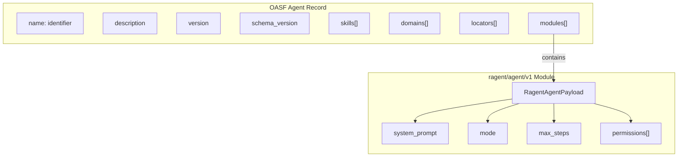

# Open Agentic Schema Framework (OASF)

**Type:** technology

### From: oasf

The Open Agentic Schema Framework (OASF) is a standardized schema specification designed to enable interoperability between AI agent systems through common data structures and taxonomies. Developed by Outshift (formerly Cisco's Emerging Technology & Incubation group), OASF provides a vendor-neutral foundation for describing agent capabilities, domains, and metadata that can be shared across different agent platforms and tooling ecosystems.

OASF defines a canonical envelope format for agent records that includes standard fields such as name, description, version, schema_version, skills, domains, locators, and extension modules. This envelope approach allows the framework to evolve through versioned schema specifications while maintaining backward compatibility. The hierarchical taxonomy system for skills (e.g., "software_engineering/code_review") and domains (e.g., "technology/software_development") enables semantic categorization and discovery of agents across registries and marketplaces.

The framework's extension module system is particularly significant for implementation-specific customization. By defining a standard module structure with type discriminators and opaque payloads, OASF allows individual agent platforms to embed proprietary configuration while remaining compliant with the core specification. This design pattern is exemplified in the ragent implementation where the "ragent/agent/v1" module type encapsulates runtime-specific parameters like system prompts, execution modes, and permission rules without polluting the interoperable envelope structure.

## Diagram

## External Resources

- [Official OASF schema specification and documentation](https://schema.oasf.outshift.com/) - Official OASF schema specification and documentation
- [Outshift - Cisco's emerging technology incubation group developing OASF](https://outshift.com/) - Outshift - Cisco's emerging technology incubation group developing OASF

## Sources

- [oasf](../sources/oasf.md)
