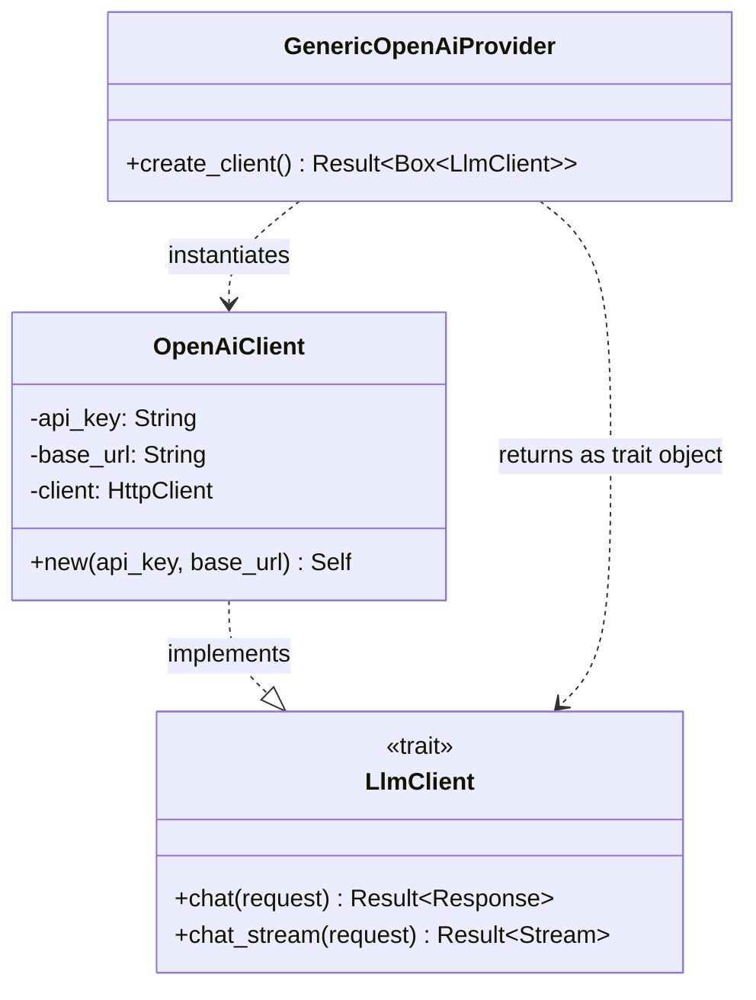

# OpenAiClient

**Type:** technology

### From: generic_openai

The `OpenAiClient` is the underlying HTTP client implementation that handles actual communication with OpenAI-compatible API endpoints. This struct is instantiated by `GenericOpenAiProvider` with a resolved base URL and API key, encapsulating all network operations, request serialization, response handling, and error management. The client implements the `LlmClient` trait, providing a common interface that allows the broader system to work with different LLM providers interchangeably through dynamic dispatch.

The client's design follows Rust's ownership and borrowing rules, taking ownership of the API key string and base URL string during construction. This ensures thread safety and eliminates lifetime complications that would arise from borrowed references. The `new` constructor accepts the resolved base URL from the provider, meaning `OpenAiClient` itself is agnostic to how that URL was determined—it simply uses whatever endpoint it's given. This separation of concerns between provider configuration and client execution enables clean testing and modular architecture.

The `OpenAiClient` implements the complete OpenAI Chat Completions API protocol, including streaming and non-streaming request variants, proper header authentication via Bearer tokens, JSON request/response handling through serde, and appropriate error conversion to the `anyhow::Result` type used throughout the crate. By wrapping this client in `Box<dyn LlmClient>`, the `GenericOpenAiProvider` enables runtime polymorphism, allowing different provider implementations to return their specific client types through a common interface. This pattern is essential for supporting multiple LLM backends in a unified application architecture.

## Diagram

## External Resources

- [Reqwest HTTP client library commonly used for API clients in Rust](https://docs.rs/reqwest/latest/reqwest/) - Reqwest HTTP client library commonly used for API clients in Rust
- [Serde serialization framework for Rust](https://serde.rs/) - Serde serialization framework for Rust

## Sources

- [generic_openai](../sources/generic-openai.md)
