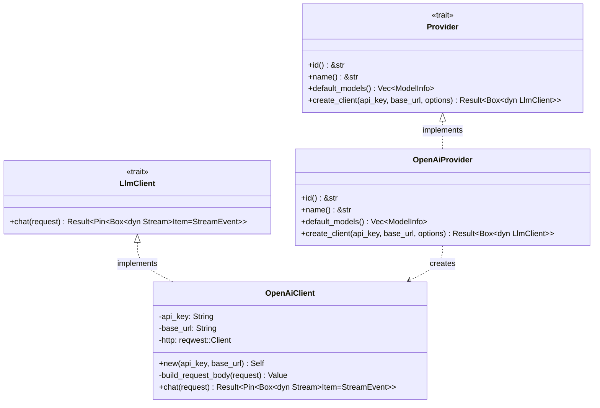

# OpenAiProvider

**Type:** technology

### From: openai

The `OpenAiProvider` struct serves as the primary entry point and configuration hub for OpenAI integration within this Rust LLM framework. It implements the `Provider` trait, enabling dependency injection and polymorphic use alongside other LLM providers. The struct itself is a zero-sized type (ZST) containing no fields, as its purpose is to define behavior through trait implementation rather than maintain state. This design pattern allows the provider to be instantiated cheaply and used as a factory for creating configured client instances.

The provider defines the canonical identifier "openai" and display name "OpenAI" through its `id` and `name` methods, establishing a clear contract for the framework's provider registry. The `default_models` method exposes GPT-4o and GPT-4o Mini configurations with accurate pricing (input at $2.50 and $0.15 per million tokens respectively, output at $10.00 and $0.60) and capability flags. These model definitions include context window sizes of 128,000 tokens and maximum output limits of 16,384 tokens, reflecting the actual constraints of the underlying OpenAI API.

The most significant functionality is `create_client`, an async method that instantiates an `OpenAiClient` with proper authentication and endpoint configuration. This method accepts an API key, optional base URL override for custom endpoints or OpenAI-compatible services, and additional options stored as generic JSON values. The implementation demonstrates forward compatibility design by accepting options even when not immediately used, allowing future extensions without breaking the API contract.

## Diagram

## External Resources

- [OpenAI API Reference Documentation](https://platform.openai.com/docs/api-reference) - OpenAI API Reference Documentation
- [async-trait crate for async trait methods in Rust](https://crates.io/crates/async-trait) - async-trait crate for async trait methods in Rust

## Sources

- [openai](../sources/openai.md)
