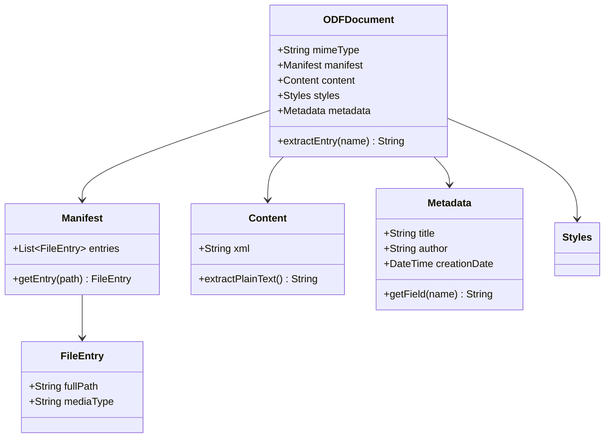

# OpenDocument Format (ODF)

**Type:** technology

### From: libreoffice_common

The OpenDocument Format (ODF) is an open document file format for saving and exchanging editable office documents such as text documents, spreadsheets, presentations, and graphics. It was originally developed by Sun Microsystems for the OpenOffice.org suite and was later standardized by OASIS in 2005 and subsequently by ISO/IEC as ISO/IEC 26300. ODF is based on XML and uses ZIP compression for packaging multiple XML files and associated resources into a single document file with extensions like .odt, .ods, .odp, and .odg.

The technical architecture of ODF reflects a deliberate design for interoperability and long-term preservation. Each ODF document is essentially a ZIP archive containing a structured collection of XML files. The `content.xml` file contains the actual document content with semantic markup; `styles.xml` contains formatting definitions; `meta.xml` holds document metadata like title, author, and creation dates; and `META-INF/manifest.xml` provides a manifest of all files in the archive. This separation of concerns enables processors to extract specific information without parsing entire documents. The format uses XML namespaces extensively to avoid conflicts and support extensibility.

ODF's standardization and open specification have made it a cornerstone of digital sovereignty initiatives worldwide. Unlike proprietary formats, ODF documents can be processed by any software implementing the specification, eliminating vendor lock-in. The format's longevity is ensured by its publication as an ISO standard and its maintenance by an open standards organization rather than a single vendor. For developers, this means that building ODF support is a matter of implementing a well-documented specification rather than reverse-engineering undocumented binary formats. The module under examination leverages these architectural properties to provide reliable document processing capabilities.

## Diagram

## External Resources

- [OASIS Open Document Format for Office Applications Technical Committee](https://www.oasis-open.org/committees/tc_home.php?wg_abbrev=office) - OASIS Open Document Format for Office Applications Technical Committee
- [ISO/IEC 26300 Open Document Format for Office Applications standard](https://www.iso.org/standard/66363.html) - ISO/IEC 26300 Open Document Format for Office Applications standard
- [Wikipedia article on ODF technical specifications and adoption](https://en.wikipedia.org/wiki/OpenDocument) - Wikipedia article on ODF technical specifications and adoption

## Sources

- [libreoffice_common](../sources/libreoffice-common.md)

### From: libreoffice_info

The OpenDocument Format is an open XML-based document file format for office applications, standardized by OASIS and adopted as an ISO/IEC international standard (ISO/IEC 26300). Developed originally by Sun Microsystems for OpenOffice.org, ODF was designed as an open alternative to proprietary formats like Microsoft Office's binary formats. The format's specification is publicly available and royalty-free, ensuring long-term accessibility of documents and reducing vendor lock-in. ODF serves as the native format for LibreOffice, OpenOffice, and numerous other office suites, and is supported by Microsoft Office through converters and native editing capabilities.

ODF's technical architecture is built upon a ZIP-compressed package containing XML files and optional binary resources (images, embedded objects). This design enables efficient storage, easy manual inspection (ZIP tools can extract contents), and straightforward programmatic manipulation. The core structure includes `content.xml` (document body), `styles.xml` (formatting definitions), `meta.xml` (metadata), and `settings.xml` (application-specific preferences). This separation of concerns facilitates tools like LibreInfoTool that need only extract metadata without parsing full document semantics. The format supports multiple document types through namespace and schema variations: text documents (ODT), spreadsheets (ODS), presentations (ODP), drawings (ODG), charts (ODC), and mathematical formulas (ODF).

The format's XML schemas define rich semantic structures—paragraphs with styles in text documents, cells with references in spreadsheets, pages with master slide relationships in presentations. ODF employs extensive use of XML namespaces to avoid element name collisions and enable mixed content from different vocabularies. The specification includes features for accessibility, change tracking, digital signatures, and encryption, making it suitable for enterprise and government deployments. Many jurisdictions have mandated ODF for public documents to ensure transparency and archival stability, including the European Union's decision to recommend ODF as a standard format.
