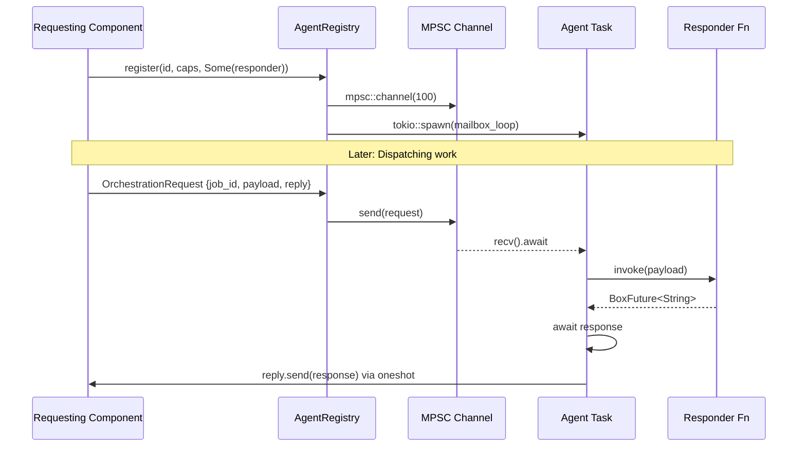

# OrchestrationRequest

**Type:** technology

### From: registry

OrchestrationRequest serves as the fundamental message type for actor-style communication between the registry and registered agents. This struct encapsulates all necessary information for dispatching work to agents and receiving asynchronous responses, forming the backbone of the system's message-passing architecture. Each request carries a unique job identifier for tracking and correlation, a payload containing the actual work data as a string, and a one-shot reply channel for returning results.

The design reflects careful consideration of Rust's ownership and concurrency model. The payload uses String rather than borrowed references to ensure the request can be sent across thread boundaries and have independent lifetime from its creator. The oneshot::Sender<String> provides exactly-once delivery semantics for responses, with automatic channel closure after the first send—preventing duplicate responses and providing clear failure signals if the requesting task has been cancelled.

This message type enables the registry's hybrid communication model. For in-process agents with registered responders, the registry spawns a background task that pulls OrchestrationRequest messages from an MPSC mailbox, invokes the responder callback with the payload, and forwards the result through the reply channel. This indirection allows agents to implement their processing logic independently while the registry handles the async plumbing and channel management.

The struct's simplicity belies its flexibility—payload as a generic string enables JSON, protobuf, or custom serialization schemes without coupling the transport layer to specific data formats. Similarly, the job_id field supports distributed tracing and logging correlation across agent boundaries, essential for debugging complex multi-hop workflows in production systems.

## Diagram

## External Resources

- [Tokio one-shot channel documentation for single-use async communication](https://docs.rs/tokio/latest/tokio/sync/oneshot/) - Tokio one-shot channel documentation for single-use async communication
- [Rust concurrency model and message passing patterns](https://doc.rust-lang.org/book/ch16-00-concurrency.html) - Rust concurrency model and message passing patterns

## Sources

- [registry](../sources/registry.md)
