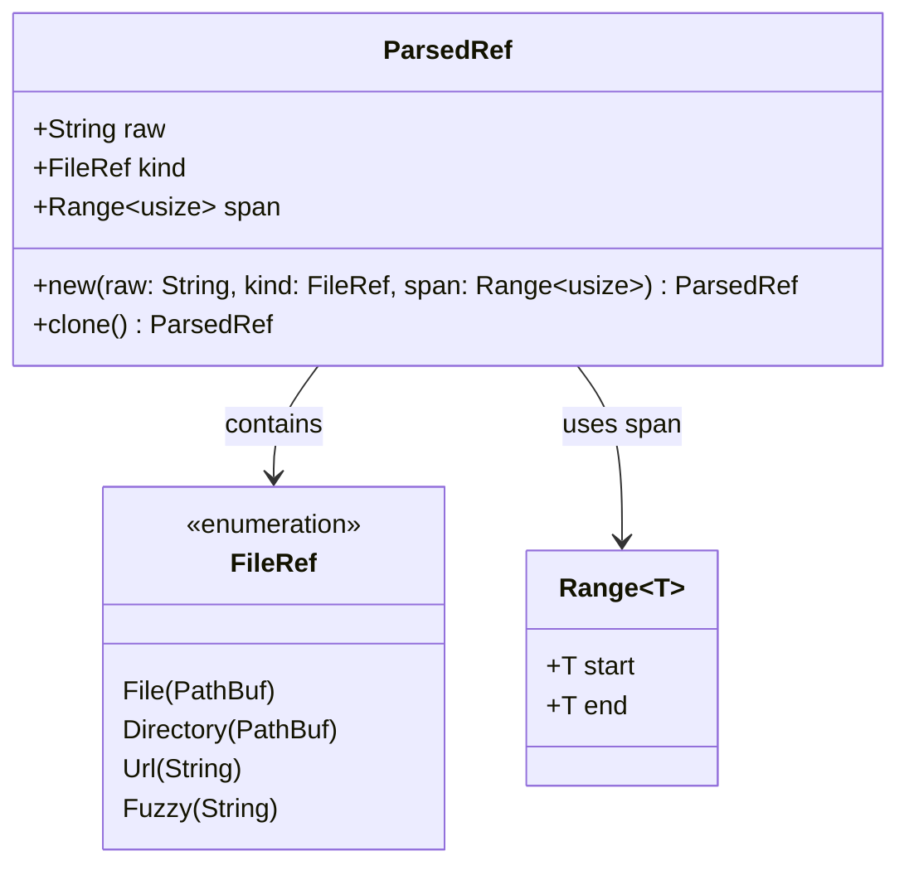

# ParsedRef

**Type:** technology

### From: parse

The `ParsedRef` struct represents a successfully detected and classified `@` reference within user input text, serving as the primary output type of the reference parsing system. This struct encapsulates three critical pieces of information: the raw text following the `@` symbol (stored as a `String`), the semantic classification of that reference via the `FileRef` enum, and the exact byte-level span indicating where the reference appears in the original input string. The span is particularly important for downstream operations, as it enables precise text replacement, highlighting, or extraction without requiring re-parsing.

The struct derives standard Rust traits including `Debug`, `Clone`, `PartialEq`, and `Eq`, making it suitable for logging, duplication, equality testing, and use as a key in hash-based collections. The design follows Rust's ownership and borrowing rules carefully—the `raw` field owns its string data while `span` contains copyable `Range<usize>` indices, allowing efficient memory management even when multiple `ParsedRef` instances are collected into vectors. The `kind` field's `FileRef` type determines how the reference should be resolved: file paths may be read from disk, directories may trigger recursive traversal, URLs may be fetched remotely, and fuzzy names may require project-wide symbol matching.

In the broader system architecture, `ParsedRef` instances likely flow from the parsing layer into resolution and context assembly components. The span information enables sophisticated user interface features such as hover tooltips showing resolved content, click-to-open functionality, or inline preview expansion. The separation between raw text and classified kind allows for flexible handling—if classification is ambiguous or user-specific overrides exist, the original text remains available for alternative interpretation strategies.

## Diagram

## External Resources

- [Rust standard library documentation for Range, used for span tracking](https://doc.rust-lang.org/std/ops/struct.Range.html) - Rust standard library documentation for Range, used for span tracking
- [Rust String type documentation for raw text storage](https://doc.rust-lang.org/std/string/struct.String.html) - Rust String type documentation for raw text storage

## Sources

- [parse](../sources/parse.md)
