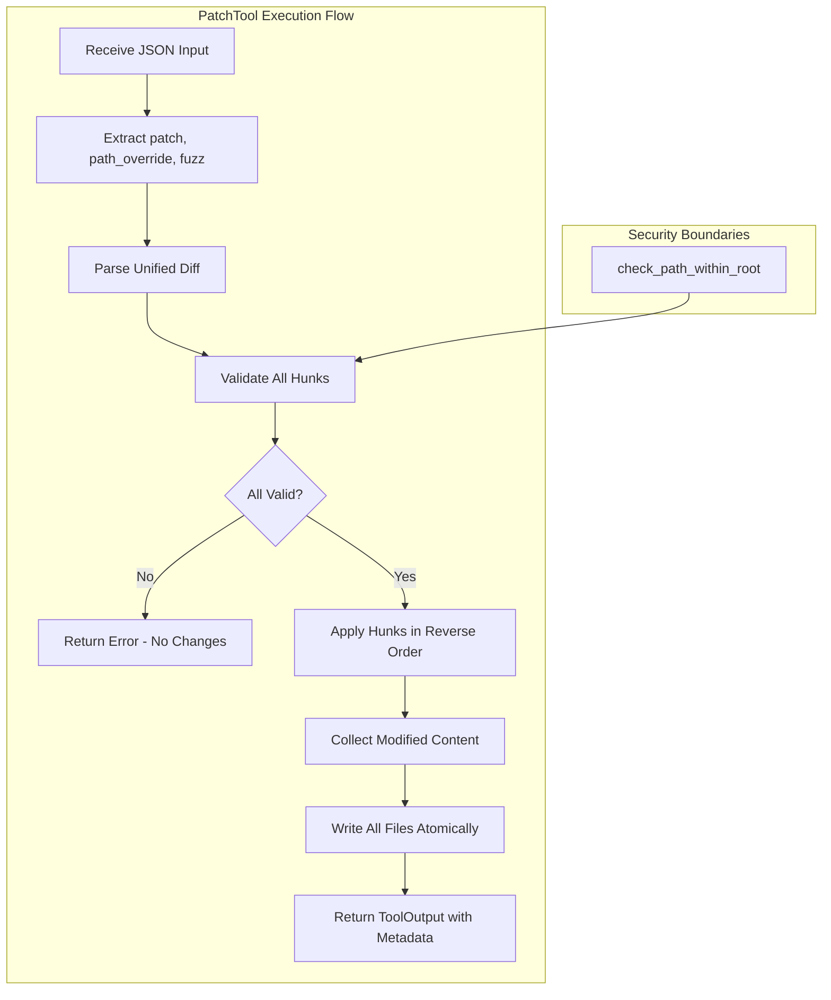

# PatchTool

**Type:** technology

### From: patch

PatchTool is the primary public struct exported by this module, implementing the Tool trait to provide unified diff patch application capabilities within the ragent-core framework. It serves as the interface between higher-level agent orchestration and low-level file modification operations, encapsulating the entire lifecycle of patch processing from parameter validation through atomic application. The tool is designed with safety as a foundational principle: it implements a two-phase commit pattern where all hunks are validated against their target files before any write operations occur, ensuring that partially-applied patches cannot leave the filesystem in an inconsistent state. This design choice reflects lessons from decades of patch utility evolution, where failed patches were historically a common source of repository corruption and developer frustration.

The implementation leverages Rust's async/await patterns for non-blocking file I/O, using tokio for filesystem operations that might otherwise stall an asynchronous runtime. Parameter schema definition through serde_json enables dynamic validation and documentation generation, with support for optional path overrides that allow single-file patches to be redirected to different targets—a common requirement in build system integration and deployment automation. The permission category of "file:write" integrates with a capability-based security model, ensuring that agents must explicitly request and be granted write permissions before this tool can be invoked. This security-conscious design is essential for agentic systems where autonomous code execution must be sandboxed and auditable.

The tool's execute method orchestrates a complex pipeline: parsing the unified diff into structured representations, resolving paths against a working directory with traversal protection, reading target files, applying hunks in reverse line-number order to prevent offset drift, and finally writing all modifications. The reverse-order application is a subtle but important optimization that ensures earlier hunks don't invalidate the line number references of later hunks within the same file. Metadata collection throughout this process enables comprehensive reporting, supporting both human-readable summaries and machine-consumable JSON output for downstream automation.

## Diagram

## External Resources

- [Tokio asynchronous filesystem operations documentation](https://docs.rs/tokio/latest/tokio/fs/) - Tokio asynchronous filesystem operations documentation
- [Serde serialization framework for Rust](https://serde.rs/) - Serde serialization framework for Rust

## Sources

- [patch](../sources/patch.md)
