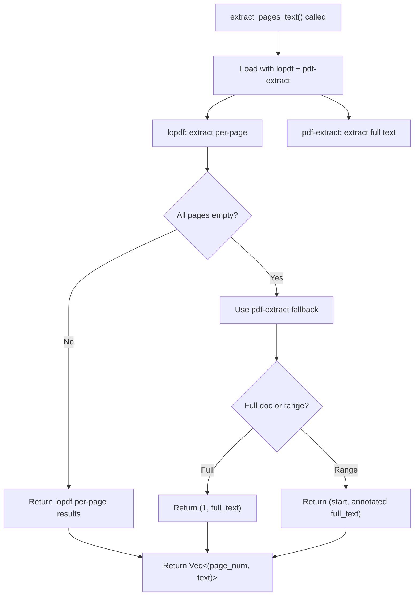

# pdf-extract

**Type:** technology

### From: pdf_read

pdf-extract is a Rust crate specializing in high-quality text extraction from PDF documents, positioned in this implementation as a complementary technology to lopdf rather than a replacement. The library serves a crucial role as a robust fallback mechanism and validation layer, invoked through `pdf_extract::extract_text_from_mem` to extract text from entire documents when the more granular lopdf-based page-by-page extraction proves insufficient. This dual-library approach reflects pragmatic engineering wisdom: pdf-extract handles the complexity of PDF text extraction heuristics—including font encoding, text positioning, and layout analysis—while lopdf provides the structural access needed for page-specific operations.

The implementation's use of pdf-extract reveals important characteristics about PDF text extraction as a domain. PDF documents do not inherently contain text in a structured, easily extractable form; instead, text exists as rendering instructions within content streams. pdf-extract applies sophisticated algorithms to reconstruct reading order and extract meaningful text, handling complexities like multi-column layouts, rotated text, and various font encodings that would require enormous effort to implement from scratch. The library returns extracted text as a single string, which the implementation then uses strategically: when all pages extracted via lopdf return empty content, the full pdf-extract output provides a graceful degradation path.

This fallback pattern—checking `all_empty` and substituting pdf-extract's comprehensive output—demonstrates the library's value proposition. It trades fine-grained page control for extraction reliability, serving as a safety net when documents use PDF features that complicate direct content stream parsing. The implementation's comment noting that "pdf-extract doesn't provide per-page extraction directly" acknowledges this trade-off, while the subsequent fallback logic shows how the two libraries combine to cover each other's limitations. For agent systems processing arbitrary PDFs from unknown sources, this redundancy ensures higher success rates in document comprehension tasks.

## Diagram

## External Resources

- [pdf-extract GitHub repository - PDF text extraction library for Rust](https://github.com/jrmuizel/pdf-extract) - pdf-extract GitHub repository - PDF text extraction library for Rust
- [pdf-extract crate on crates.io with documentation](https://crates.io/crates/pdf-extract) - pdf-extract crate on crates.io with documentation

## Sources

- [pdf_read](../sources/pdf-read.md)
