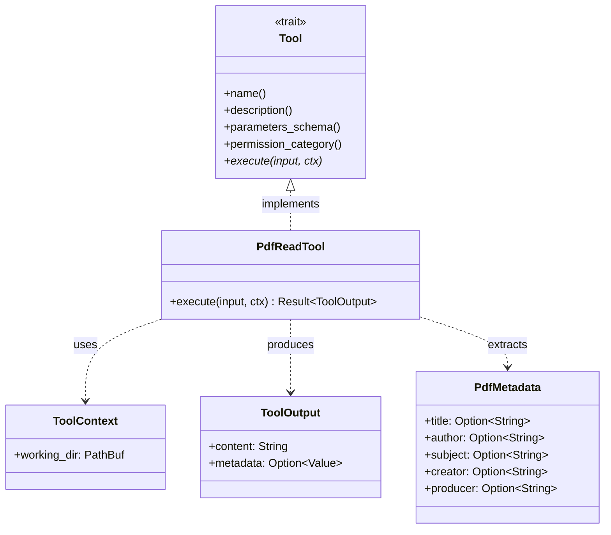

# PdfReadTool

**Type:** product

### From: pdf_read

PdfReadTool represents a production-grade implementation of a document reading tool within the ragent agent framework, designed to provide intelligent systems with reliable access to PDF content. As a struct implementing the `Tool` trait, it serves as the interface between agent reasoning and document processing capabilities, exposing functionality through a well-defined schema that enables autonomous operation. The tool's design reflects careful consideration of the full lifecycle of document processing in agent systems: from parameter validation and security-aware path resolution through multiple output format generation to result truncation for safe integration with context-window-limited language models.

The tool's architecture demonstrates sophisticated feature design catering to diverse agent use cases. The three output formats—text, metadata, and JSON—map to distinct operational modes: text for direct content ingestion into language model contexts, metadata for document cataloging and relevance filtering, and JSON for structured data extraction where downstream processing requires programmatic access to both content and document properties. The page range parameters (start_page, end_page) enable efficient processing of large documents by allowing agents to request specific sections, while the 1-based indexing with inclusive ranges aligns with human-readable document conventions rather than programmer-centric 0-based indexing.

Security and operational concerns permeate the implementation. The `permission_category` of "file:read" enables the ragent system to apply appropriate access controls, preventing unauthorized file access in multi-tenant or sandboxed environments. Path resolution through `resolve_path` ensures safe handling of relative paths against a configured working directory, mitigating directory traversal attacks. The `MAX_OUTPUT_BYTES` constraint and `truncate_output` application prevent memory exhaustion and context window overflow when processing large documents—critical for agent systems where unpredictable input sizes could otherwise destabilize operations. These characteristics position PdfReadTool not as a simple utility but as a hardened component suitable for autonomous agent deployment.

## Diagram

## External Resources

- [Source code for PdfReadTool in the ragent-core repository](https://github.com/axflow/axflow/blob/main/crates/ragent-core/src/tool/pdf_read.rs) - Source code for PdfReadTool in the ragent-core repository

## Sources

- [pdf_read](../sources/pdf-read.md)
