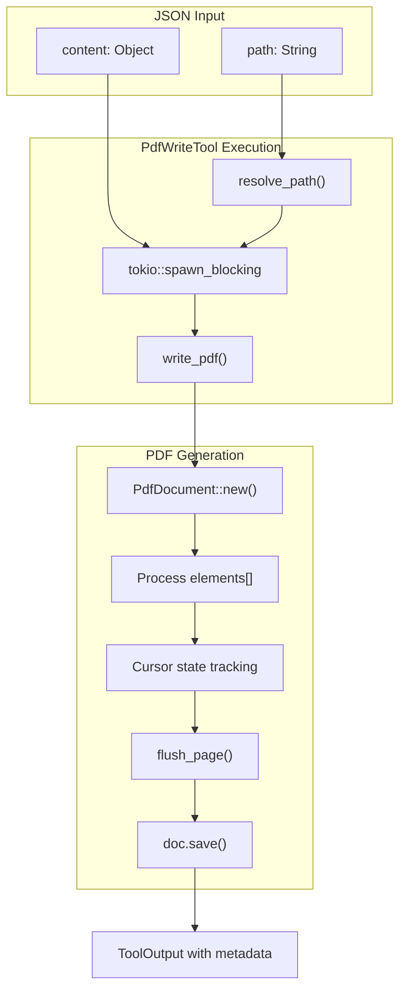

# PdfWriteTool

**Type:** technology

### From: pdf_write

The PdfWriteTool is a Rust struct that serves as the primary interface for PDF generation within the RAgent core system. This tool implements the `Tool` trait, making it discoverable and executable by the agent framework. The struct itself is a zero-sized type (unit struct) that carries no runtime state, with all functionality implemented through its associated methods. When executed, it accepts JSON input specifying output path and structured content, then delegates the actual PDF creation to a blocking task to prevent async runtime blocking during file I/O and PDF rendering operations. The tool is categorized under the "file:write" permission category, indicating it requires filesystem write permissions. Its design emphasizes type safety through serde_json's Value type for flexible content representation while maintaining strict schema validation for tool parameters.

The implementation demonstrates sophisticated PDF generation capabilities by wrapping the lower-level `printpdf` crate with a higher-level JSON-driven API. This abstraction allows non-technical users or automated systems to generate documents without understanding PDF internals. The tool handles edge cases including missing parent directories (automatically creating them), missing content elements, and various image format decoding scenarios. Error propagation uses `anyhow` for context-rich error messages that help diagnose issues in production environments. The async execution model with `tokio::task::spawn_blocking` reflects modern Rust async patterns for CPU-intensive or blocking operations.

Historically, this tool represents a common pattern in document automation systems where structured data (JSON) needs conversion to presentation formats (PDF). It competes with approaches like HTML-to-PDF conversion but offers more precise control over layout and eliminates web rendering dependencies. The constant definitions for page layout (A4 dimensions, margins, font sizes) follow ISO 216 and typographic conventions, ensuring professional document appearance. The cursor-based pagination algorithm, while simple, provides predictable behavior for content flow across pages.

## Diagram

## External Resources

- [printpdf crate documentation - the underlying PDF generation library](https://docs.rs/printpdf/latest/printpdf/) - printpdf crate documentation - the underlying PDF generation library
- [Serde serialization framework documentation](https://serde.rs/) - Serde serialization framework documentation
- [anyhow error handling crate](https://docs.rs/anyhow/latest/anyhow/) - anyhow error handling crate

## Sources

- [pdf_write](../sources/pdf-write.md)
