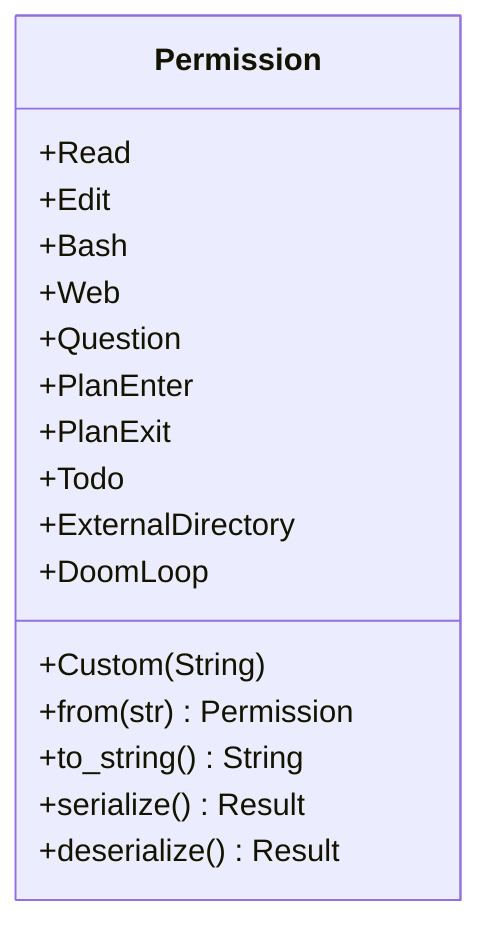

# Permission

**Type:** technology

### From: mod

The `Permission` enum defines the complete taxonomy of operation types that can be restricted within the ragent-core agent system. It encompasses nine standard variants covering common AI agent capabilities: `Read` and `Edit` for file system operations, `Bash` for shell command execution, `Web` for network access, `Question` for interactive user queries, `PlanEnter` and `PlanExit` for planning phase management, `Todo` for task list manipulation, `ExternalDirectory` for accessing paths outside the project root, and `DoomLoop` for infinite loop detection and mitigation. The enum also provides a `Custom(String)` variant for extensibility, allowing developers to define domain-specific permission types without modifying the core enumeration. This design demonstrates the open/closed principle, providing comprehensive standard coverage while remaining adaptable to specialized use cases. The enum implements `From<&str>` for flexible string-based construction, `Display` for human-readable formatting, and custom `Serialize`/`Deserialize` implementations that use string representation rather than integer discriminants. This string-based serialization ensures cross-version compatibility and human-readable configuration files, critical for a security-sensitive system where permission definitions may be audited and manually reviewed.

## Diagram

## External Resources

- [Rust From trait for type conversions](https://doc.rust-lang.org/std/convert/trait.From.html) - Rust From trait for type conversions
- [Rust Display trait for formatting](https://doc.rust-lang.org/std/fmt/trait.Display.html) - Rust Display trait for formatting

## Sources

- [mod](../sources/mod.md)
