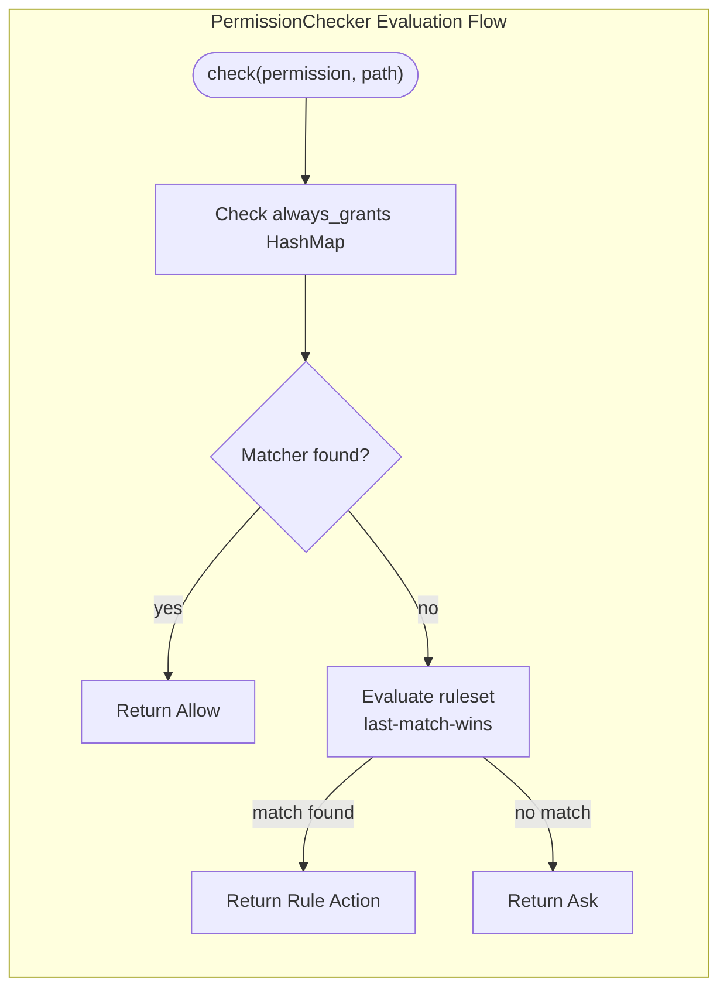

# PermissionChecker

**Type:** technology

### From: mod

The `PermissionChecker` struct serves as the central evaluation engine for the permission system in ragent-core. It maintains two primary data structures: a static `ruleset` containing ordered `PermissionRule` definitions, and a dynamic `always_grants` HashMap that stores permanent grants established at runtime. The checker implements a hierarchical evaluation strategy where permanent grants are checked first, followed by ruleset evaluation using a last-match-wins algorithm. This design allows administrators to configure base policies while enabling users to establish persistent exceptions through interactive confirmation workflows. The struct provides two primary public methods: `new()` for initialization with a ruleset, and `check()` for evaluating permission requests against both static rules and runtime grants. The `record_always()` method enables the accumulation of permanent grants, which are stored as compiled `globset::GlobMatcher` instances for efficient pattern matching. This architecture supports high-performance permission evaluation with predictable precedence rules, making it suitable for real-time agent decision-making scenarios.

## Diagram

## External Resources

- [Globset crate documentation for pattern matching](https://docs.rs/globset/latest/globset/) - Globset crate documentation for pattern matching
- [Serde serialization framework documentation](https://serde.rs/) - Serde serialization framework documentation

## Sources

- [mod](../sources/mod.md)
