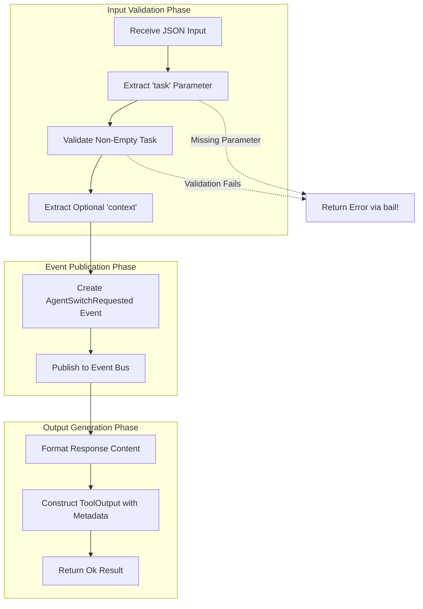

# PlanEnterTool

**Type:** technology

### From: plan

The `PlanEnterTool` is a concrete implementation of the `Tool` trait that serves as the entry point for delegating tasks to a specialized planning agent within the ragent-core framework. When instantiated and executed, this tool performs validation on the incoming task parameter to ensure non-empty, meaningful task descriptions are provided for the planning agent. Upon successful validation, it constructs and publishes an `AgentSwitchRequested` event to the system's event bus, which acts as the signaling mechanism for the session processor to initiate an agent context switch. The tool's architecture reflects a careful separation of concerns: parameter validation occurs at the tool level, while the actual agent lifecycle management is delegated to the broader session management infrastructure through events. The tool returns structured metadata including an `agent_switch` field set to "plan", which serves as a contract between the tool execution layer and the session processor. This metadata-driven approach allows the system to maintain loose coupling while enabling precise coordination between tool execution outcomes and system state transitions. The tool's permission category of "plan" categorizes it within the broader security and permission framework of the system, potentially enabling fine-grained access control policies.

## Diagram

## External Resources

- [async-trait crate documentation for understanding the async trait implementation pattern used](https://docs.rs/async-trait/latest/async_trait/) - async-trait crate documentation for understanding the async trait implementation pattern used
- [Serde serialization framework documentation for JSON schema handling](https://serde.rs/) - Serde serialization framework documentation for JSON schema handling

## Sources

- [plan](../sources/plan.md)
