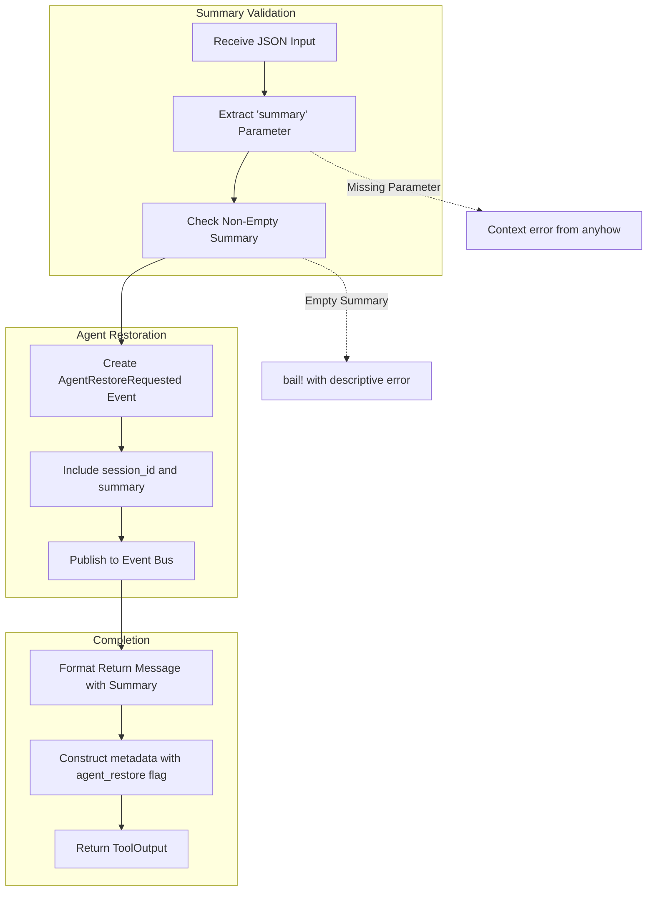

# PlanExitTool

**Type:** technology

### From: plan

The `PlanExitTool` provides the complementary functionality to `PlanEnterTool`, enabling the plan agent to gracefully return control to the previously active agent while preserving the analytical work performed. This tool implements a critical pattern in multi-agent systems: the structured handoff of context and results between specialized agents. Upon execution, it validates that a non-empty summary parameter has been provided, ensuring that the planning agent's work product is captured and returned to the calling context. The tool publishes an `AgentRestoreRequested` event containing both the session identifier and the planning summary, which allows the session processor to reconstruct the previous agent context and inject the planning results into the ongoing conversation. The metadata returned by this tool includes an `agent_restore` boolean flag and a `summary_length` metric, providing both a semantic signal for system state management and quantitative information about the handoff. The tool's design emphasizes the principle that specialized agents should be stateless with respect to the broader conversation, carrying only their specific analytical payload back to the orchestrating context. This architecture supports complex multi-step workflows where agents with different capabilities and permission levels can be composed dynamically.

## Diagram

## External Resources

- [Anyhow error handling library for ergonomic error propagation in Rust](https://docs.rs/anyhow/latest/anyhow/) - Anyhow error handling library for ergonomic error propagation in Rust
- [Tokio async messaging patterns relevant to event bus implementations](https://docs.rs/tokio/latest/tokio/sync/mpsc/) - Tokio async messaging patterns relevant to event bus implementations

## Sources

- [plan](../sources/plan.md)
