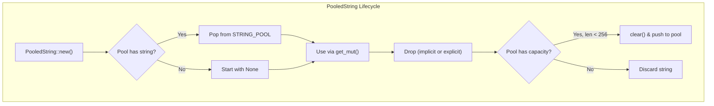

# PooledString

**Type:** technology

### From: pool

PooledString is the primary abstraction in this module, implementing a smart pointer-like wrapper that enables transparent reuse of String allocations. The struct contains a single field `inner: Option<String>` which holds either a pooled string value or None. This design is crucial for managing the lifecycle of pooled resources—when the Option is Some, the string is owned by the PooledString instance; when None, no string is currently held. The struct provides three key constructors: `new()` which attempts to acquire a string from the pool, `with_capacity()` which ensures minimum capacity, and `Default` which delegates to `new()`. The `get_mut()` method implements lazy initialization, calling `Option::get_or_insert_with(String::new)` to create a string on first access if none was pooled. The `into_string()` method consumes the PooledString and returns the owned String, or a default empty string if none existed. Critically, PooledString implements the Drop trait with custom logic: when dropped, if it contains a string and the thread-local pool has capacity, it clears the string and returns it to the pool for reuse. This automatic return mechanism is what makes the pooling transparent—users simply use PooledString like a regular String wrapper without explicit pool management calls. The type is marked with `#[must_use]` on constructors to encourage proper handling of the pooled resource.

## Diagram

## External Resources

- [Rust Drop trait documentation for deterministic resource cleanup](https://doc.rust-lang.org/std/ops/trait.Drop.html) - Rust Drop trait documentation for deterministic resource cleanup
- [Rust Option enum used for optional value handling in PooledString](https://doc.rust-lang.org/std/option/enum.Option.html) - Rust Option enum used for optional value handling in PooledString
- [Rust design patterns for Drop trait usage](https://rust-unofficial.github.io/patterns/idioms/drop.html) - Rust design patterns for Drop trait usage

## Sources

- [pool](../sources/pool.md)
