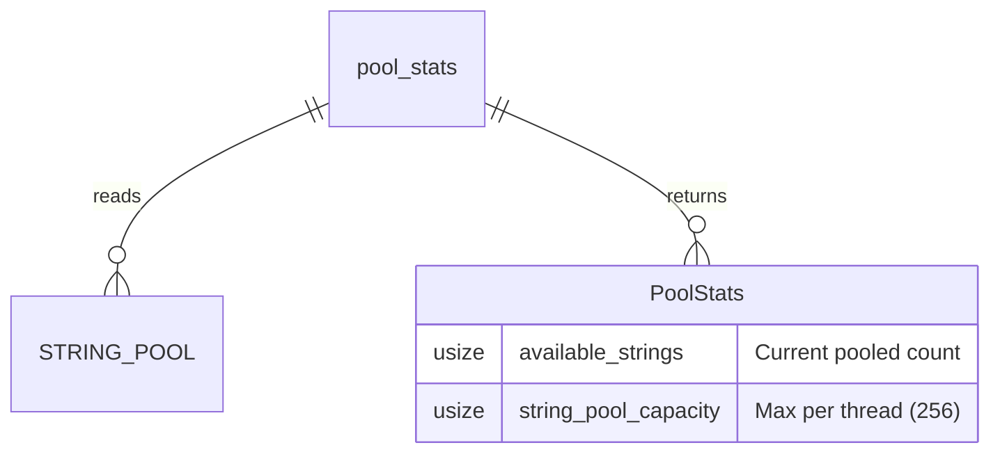

# PoolStats

**Type:** technology

### From: pool

PoolStats is a diagnostic struct providing observability into the message pool's operational state, designed with #[derive(Debug, Default, Clone, Copy)] for convenient use in logging, metrics, and debugging contexts. The struct contains two usize fields: `available_strings` representing the current count of strings in the pool ready for reuse, and `string_pool_capacity` which mirrors the TEXT_POOL_SIZE constant. This design follows Rust conventions for statistics structures—using copyable primitives rather than references ensures the stats can be freely passed between threads and stored without lifetime concerns. The `pool_stats()` function populates this struct by accessing the thread-local pool and reading its length, wrapped in the thread-local `with` closure pattern. The separation between current availability and total capacity enables calculating utilization percentages, which can indicate whether the pool size is appropriately tuned for the workload. A consistently full pool suggests the TEXT_POOL_SIZE may be too small, missing reuse opportunities, while an consistently empty pool indicates over-provisioning. The struct's Debug derivation enables easy logging with `{:?}` format strings, while Clone and Copy allow efficient handling in async contexts where ownership transfer might be problematic. Future extensions could add historical counters like total allocations served, pool misses requiring fresh allocations, or peak utilization tracking.

## Diagram

## External Resources

- [Rust Debug trait for formatter output](https://doc.rust-lang.org/std/fmt/trait.Debug.html) - Rust Debug trait for formatter output
- [Rust Clone trait for explicit duplication](https://doc.rust-lang.org/std/clone/trait.Clone.html) - Rust Clone trait for explicit duplication

## Sources

- [pool](../sources/pool.md)
