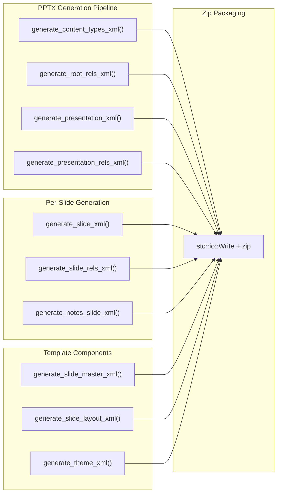

# PowerPoint PPTX Writer

**Type:** technology

### From: office_write

The PowerPoint writing capability in OfficeWriteTool represents a custom implementation for generating .pptx files, as the code excerpt shows extensive XML generation functions rather than reliance on a dedicated library. This approach involves manually constructing the Office Open XML Presentation format, which consists of multiple interrelated XML parts within a zip package. The implementation includes specialized functions for generating each required component: `generate_content_types_xml` for the [Content_Types].xml that maps file extensions to content types, `generate_root_rels_xml` for package relationships, `generate_presentation_xml` for the main presentation structure, and various `generate_slide_*` functions for individual slide content. The custom XML generation handles slides with title and body text, speaker notes, slide masters, layouts, and themes. A critical component is the `xml_escape` function, which ensures that special XML characters in slide content are properly escaped to maintain document validity. The tool accommodates flexible input formats, accepting either a direct array of slide objects or an object containing a `slides` array, with robust extraction through the `extract_slides` and `flatten_pptx_elements` helper functions. This custom approach, while more complex than using a library, provides fine-grained control over presentation generation and reduces external dependencies.

## Diagram

## External Resources

- [Microsoft Open XML SDK documentation](https://learn.microsoft.com/en-us/office/open-xml/open-xml-sdk) - Microsoft Open XML SDK documentation
- [Office Open XML format specification overview](https://en.wikipedia.org/wiki/Office_Open_XML) - Office Open XML format specification overview

## Sources

- [office_write](../sources/office-write.md)
