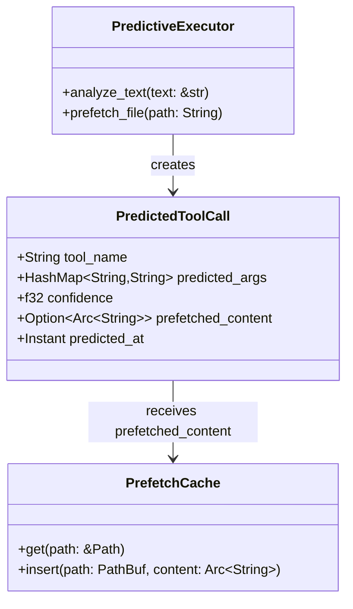

# PredictedToolCall

**Type:** technology

### From: predictive

PredictedToolCall is a core data structure that represents the outcome of the predictive analysis process, capturing both the predicted tool invocation and associated metadata necessary for speculative execution. This struct embodies the system's confidence-based approach to prediction, storing not just the tool name and arguments but also a floating-point confidence score ranging from 0.0 to 1.0 that reflects the strength of the pattern match that triggered the prediction. The confidence scoring mechanism allows downstream components to make informed decisions about whether to act on a prediction, enabling risk-adjusted speculative execution where higher confidence predictions might trigger more aggressive pre-computation.

The struct's design reflects careful consideration of the streaming nature of LLM interactions. The `predicted_args` field uses a `HashMap<String, String>` to store partially constructed arguments that may be incomplete during the streaming process, allowing the system to accumulate argument fragments as they arrive rather than requiring complete JSON structures upfront. The `prefetched_content` field optionally holds an `Arc<String>` reference to pre-fetched file data, enabling zero-copy sharing of cached content across asynchronous boundaries when the prediction is ultimately fulfilled. The inclusion of a `predicted_at` timestamp using `std::time::Instant` enables temporal analysis of prediction accuracy and latency characteristics, supporting future optimizations based on empirical performance data.

The use of `Arc` for string content and the overall structure design demonstrates sophisticated Rust memory management patterns. By wrapping potentially large file contents in reference-counted pointers, the system avoids expensive cloning operations while maintaining thread safety across the async runtime. The struct derives `Debug` and `Clone` traits to facilitate logging, testing, and storage in collection types, with the clone operation being relatively inexpensive due to the `Arc` usage. This design choice reflects the module's emphasis on performance and concurrency, ensuring that predicted tool calls can be efficiently passed between the prediction detection code, the pre-fetch workers, and the eventual tool execution handlers without blocking or excessive memory allocation.

## Diagram

## External Resources

- [Rust Arc documentation - atomic reference counting for shared ownership](https://doc.rust-lang.org/std/sync/struct.Arc.html) - Rust Arc documentation - atomic reference counting for shared ownership
- [Rust Instant documentation - monotonic timestamps for performance measurement](https://doc.rust-lang.org/std/time/struct.Instant.html) - Rust Instant documentation - monotonic timestamps for performance measurement

## Sources

- [predictive](../sources/predictive.md)
