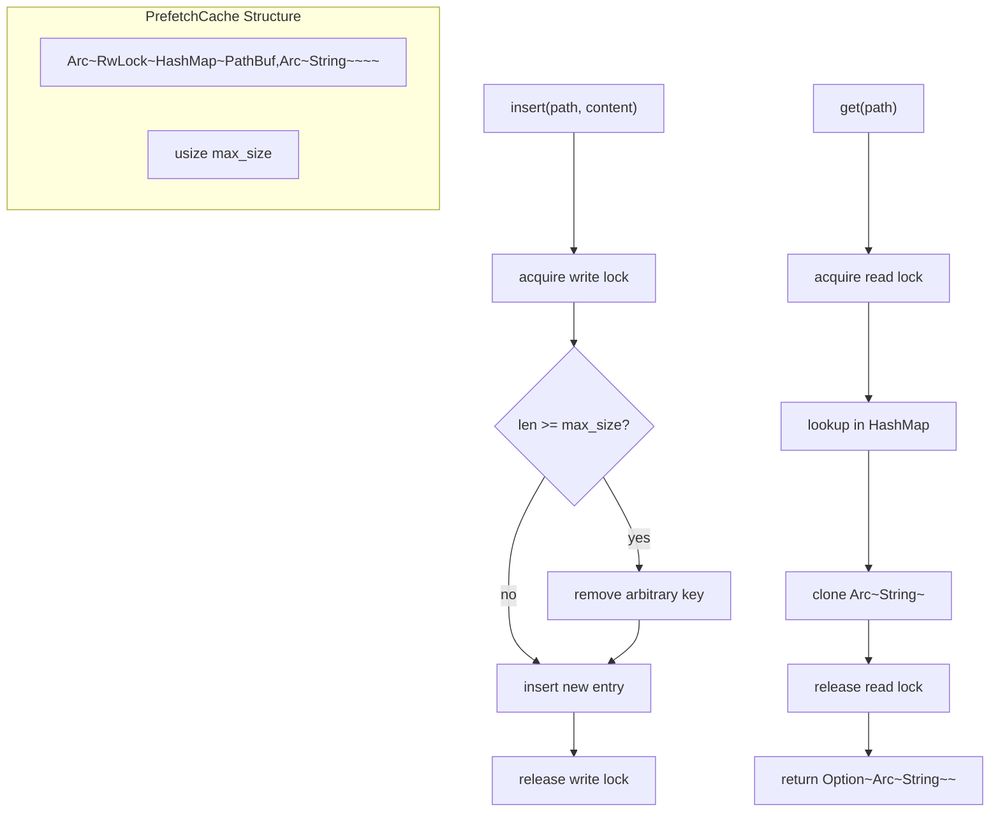

# PrefetchCache

**Type:** technology

### From: predictive

PrefetchCache implements a concurrent, asynchronous cache specifically optimized for storing pre-fetched file contents in the predictive execution pipeline. The struct addresses the challenging requirements of high-concurrency async Rust programming by combining `Arc<RwLock<HashMap<PathBuf, Arc<String>>>>` to provide thread-safe, shared mutable access to cached data. This layered approach uses `RwLock` to allow multiple concurrent readers while ensuring exclusive access for write operations, with `Arc` enabling safe sharing of the lock-protected data across asynchronous task boundaries. The design reflects deep understanding of Rust's ownership system and the specific concurrency patterns common in tokio-based applications.

The cache implements a simple but effective eviction strategy that removes arbitrary entries when capacity is exceeded, with the code explicitly noting that production deployments should use LRU (Least Recently Used) eviction for better performance characteristics. This pragmatic approach balances implementation complexity against immediate functionality, providing a working solution while acknowledging optimization opportunities. The default capacity of 100 entries provides a reasonable trade-off between memory consumption and hit rate for typical development workflows, while the `with_capacity` constructor allows customization for memory-constrained or high-throughput scenarios. The eviction logic specifically checks for new keys before removal to avoid unnecessary churn when updating existing entries.

The API design of PrefetchCache emphasizes async-first patterns with all public methods being async and properly handling lock acquisition across await points. The `get` method acquires a read lock and returns a cloned `Arc<String>`, ensuring that callers receive owned references to cached data without holding locks during use. The `insert` method demonstrates careful lock management, acquiring a write lock and performing capacity checking and eviction within the same critical section to maintain consistency. The `clear` method provides bulk invalidation capability essential for the turn-based conversation model where predictions should not persist across unrelated interactions. This comprehensive API supports the full lifecycle of cached data in the predictive execution context.

## Diagram

## External Resources

- [Tokio RwLock documentation - async-aware read-write lock](https://docs.rs/tokio/latest/tokio/sync/struct.RwLock.html) - Tokio RwLock documentation - async-aware read-write lock
- [Wikipedia article on LRU cache replacement policies](https://en.wikipedia.org/wiki/Cache_replacement_policies#Least_recently_used_(LRU)) - Wikipedia article on LRU cache replacement policies

## Sources

- [predictive](../sources/predictive.md)
