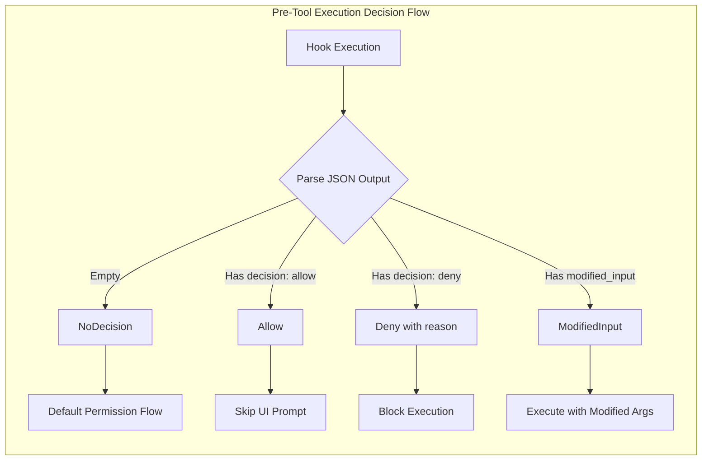

# PreToolUseResult

**Type:** technology

### From: mod

PreToolUseResult is a Rust enum representing the decision outcomes from synchronous PreToolUse hooks, forming the core of ragent's extensible permission and transformation system. Unlike other hook types that merely observe events, PreToolUse hooks participate directly in control flow through four possible results: Allow bypasses the standard UI permission prompt, enabling automated workflows for trusted tools; Deny includes an optional human-readable reason for audit trails and user feedback; ModifiedInput contains a serde_json::Value with transformed tool arguments, enabling hooks to sanitize, augment, or redirect tool invocations; and NoDecision indicates the hook abstained, falling back to default permission handling. The enum's design prioritizes clarity and exhaustive matching, with each variant carrying necessary data for its semantics. This result type enables sophisticated use cases like automatic approval of read-only operations, blocking dangerous command patterns, or transparently rewriting file paths for sandboxed environments. The synchronous nature of PreToolUse execution ensures these decisions apply before any tool side effects occur.

## Diagram

## External Resources

- [Serde's data model for JSON handling](https://serde.rs/data-model.html) - Serde's data model for JSON handling
- [Rust enum patterns for state representation](https://doc.rust-lang.org/book/ch06-01-defining-an-enum.html) - Rust enum patterns for state representation

## Sources

- [mod](../sources/mod.md)
