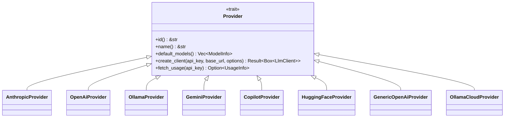

# Provider Trait

**Type:** technology

### From: mod

The `Provider` trait is the core abstraction mechanism in the Ragent framework for integrating LLM backends. Defined as an async trait with `Send + Sync` bounds, it establishes a standardized contract that all provider implementations must satisfy, enabling polymorphic treatment of diverse AI services from OpenAI to self-hosted Ollama instances. The trait specifies five essential methods: `id()` and `name()` for identification, `default_models()` for capability advertisement, `create_client()` for authenticated API client construction, and `fetch_usage()` for quota monitoring.

The `create_client()` method is particularly significant as it returns a `Box<dyn LlmClient>`, abstracting over the specific HTTP client implementation details while allowing runtime provider selection. The method accepts an API key, optional base URL for custom endpoints, and a HashMap of additional options, providing flexibility for enterprise deployments with proxy configurations or custom parameters. The default implementation of `fetch_usage()` returns `None`, but providers like GitHub Copilot override this to expose plan tiers and usage percentages, demonstrating the trait's extensibility for value-added features beyond basic chat completion.

This trait-based architecture exemplifies the type erasure pattern common in Rust systems programming, where concrete implementation details are hidden behind vtable-based dynamic dispatch. The use of `#[async_trait::async_trait]` enables async methods in traits, which would otherwise require nightly Rust features or complex manual `Pin<Box<dyn Future>>` return types. This design decision prioritizes developer ergonomics and clean asynchronous code over the minimal overhead of heap allocation for futures, a trade-off well-suited for network-bound LLM operations where latency dominates performance concerns.

## Diagram

## External Resources

- [Rust Book: Trait Objects for Dynamic Dispatch](https://doc.rust-lang.org/book/ch17-02-trait-objects.html) - Rust Book: Trait Objects for Dynamic Dispatch
- [async-trait crate documentation](https://docs.rs/async-trait/latest/async_trait/) - async-trait crate documentation
- [Rust Async Working Group: Static Async Fn in Trait](https://rust-lang.github.io/async-fundamentals-initiative/evaluation/rfcs/static-async-fn-in-trait.html) - Rust Async Working Group: Static Async Fn in Trait

## Sources

- [mod](../sources/mod.md)
