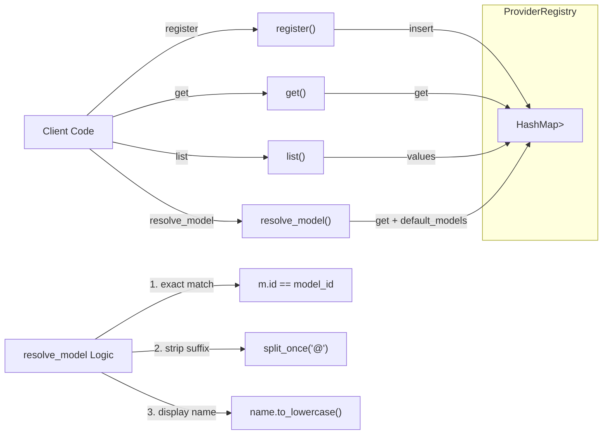

# ProviderRegistry

**Type:** technology

### From: mod

The `ProviderRegistry` struct implements the registry pattern to manage provider lifecycle and discovery within the Ragent framework. It maintains a private `HashMap<String, Box<dyn Provider>>` that maps provider identifiers to their trait object implementations, enabling O(1) lookup complexity for provider retrieval. This design centralizes provider management, preventing scattered `match` statements throughout the codebase when selecting LLM backends based on configuration or user input.

The registry provides four primary operations: `new()` for empty instantiation, `register()` for adding providers with automatic key extraction via the `Provider::id()` method, `get()` for provider retrieval, and `list()` for enumerating all registered providers as `ProviderInfo` structs. The `resolve_model()` method implements particularly sophisticated matching logic to accommodate real-world model identification complexities. It attempts exact ID matching first, then strips vendor suffixes (e.g., converting "gpt-4o@azure" to "gpt-4o"), and finally performs case-insensitive display name matching, reflecting practical lessons from deployment scenarios where model identifiers vary across environments.

The implementation leverages Rust's ownership system and borrow checker to ensure memory safety without runtime garbage collection. The `Box<dyn Provider>` heap allocation is necessary for trait objects of unknown size, while the `AsRef::as_ref` conversion in `get()` provides appropriate lifetime management for returned references. The `Default` implementation delegates to `new()`, enabling ergonomic construction in configuration contexts. This registry architecture demonstrates how Rust's type system can encode complex domain logic—like model resolution with multiple fallback strategies—while maintaining zero-cost abstractions and compile-time correctness guarantees.

## Diagram

## External Resources

- [Rust Standard Library: HashMap](https://doc.rust-lang.org/std/collections/struct.HashMap.html) - Rust Standard Library: HashMap
- [Refactoring Guru: Registry Pattern](https://refactoring.guru/design-patterns/registry) - Refactoring Guru: Registry Pattern
- [Rust Book: Advanced Lifetimes and Trait Objects](https://doc.rust-lang.org/book/ch19-05-advanced-lifetimes.html) - Rust Book: Advanced Lifetimes and Trait Objects

## Sources

- [mod](../sources/mod.md)
