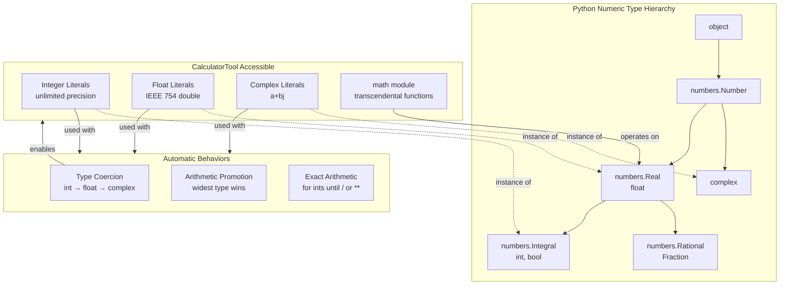

# Python Numeric Tower

**Type:** technology

### From: calculator

The Python Numeric Tower refers to Python's elegant hierarchy of numeric types and their automatic coercion behaviors, which CalculatorTool leverages by delegating expression evaluation to Python 3. At the foundation sits `int`, Python's arbitrary-precision integer type that can represent numbers of any size limited only by available memory—unlike fixed-width integers in Rust or C that overflow at architecture boundaries. Above this are `float` (IEEE 754 double precision), `complex` (pairs of floats), and `bool` (subclass of int), with the `fractions.Fraction` and `decimal.Decimal` types providing rational and fixed-precision decimal arithmetic respectively.

This numeric architecture enables CalculatorTool to handle expressions that would overflow or lose precision in many other evaluation contexts. When a user requests `2 ** 1000`, Python returns the exact 302-digit result rather than infinity or overflow. When mixing types in expressions like `3 + 4.5`, Python automatically promotes to the wider type (float in this case). Complex numbers use the electrical engineering convention with `j` as the imaginary unit, allowing expressions like `(1+2j) * (3+4j)` to evaluate correctly. The `math` module extends capabilities with transcendental functions, special functions like `gamma` and `factorial`, and constants like `pi` and `e`.

The Numeric Tower's design reflects Python's origins in scientific computing and its continued dominance in data science and machine learning ecosystems. By shelling out to Python rather than implementing a Rust-based parser, CalculatorTool inherits decades of battle-tested numeric algorithms, edge case handling, and platform-optimized implementations. This includes proper handling of signed zeros, NaN propagation, subnormal numbers, and platform-independent behavior for transcendental functions. The tradeoff is process spawn overhead—typically 10-50 milliseconds—which the implementation accepts given the significantly reduced complexity and enhanced capability compared to embedding a Rust mathematical expression evaluator with equivalent feature parity.

## Diagram

## External Resources

- [Python documentation on numeric types](https://docs.python.org/3/library/stdtypes.html#numeric-types-int-float-complex) - Python documentation on numeric types
- [Python math module - mathematical functions available to CalculatorTool](https://docs.python.org/3/library/math.html) - Python math module - mathematical functions available to CalculatorTool
- [Python decimal module - fixed-point arithmetic (notable omission from CalculatorTool's import)](https://docs.python.org/3/library/decimal.html) - Python decimal module - fixed-point arithmetic (notable omission from CalculatorTool's import)

## Sources

- [calculator](../sources/calculator.md)
