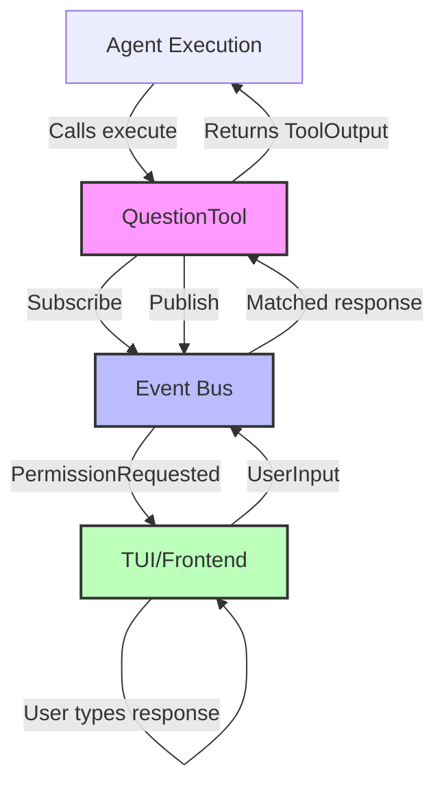

# QuestionTool

**Type:** product

### From: question

QuestionTool is a specialized user interaction component within the ragent-core framework that enables AI agents to pause execution and solicit direct textual input from human users. The tool operates as a blocking asynchronous primitive, publishing events to a shared event bus and awaiting specifically matched responses before returning control to the calling agent. Its design reflects careful consideration of distributed systems challenges, including the subscription-before-publish pattern to prevent message loss and UUID-based correlation for request-response pairing in multi-session environments.

The tool's implementation demonstrates sophisticated Rust patterns including the use of `async_trait` for defining asynchronous interfaces, `anyhow` for ergonomic error handling, and `serde_json` for schema-driven parameter validation. The blocking execution model—unusual in typically non-blocking async Rust—represents a deliberate architectural choice prioritizing simplicity of agent logic over maximum concurrency, accepting that human response times dominate latency concerns regardless of implementation efficiency. This approach simplifies agent reasoning by presenting user interaction as a synchronous function call despite the underlying asynchronous machinery.

QuestionTool exemplifies the emerging paradigm of human-AI collaborative systems where agents possess autonomy but recognize boundaries requiring human judgment. The permission category system (`permission == "question"`) suggests extensibility toward richer authorization models, potentially supporting different interaction modalities like confirmations, file selections, or multi-choice decisions. The tool's integration with the broader Event system indicates participation in a cohesive agent runtime where user interactions are first-class citizens alongside other asynchronous capabilities.

## Diagram

## External Resources

- [Tokio broadcast channel documentation for event bus implementation](https://docs.rs/tokio/latest/tokio/sync/broadcast/) - Tokio broadcast channel documentation for event bus implementation
- [async_trait crate for asynchronous trait definitions in Rust](https://docs.rs/async-trait/latest/async_trait/) - async_trait crate for asynchronous trait definitions in Rust
- [Serde serialization framework for JSON schema handling](https://serde.rs/) - Serde serialization framework for JSON schema handling

## Sources

- [question](../sources/question.md)
