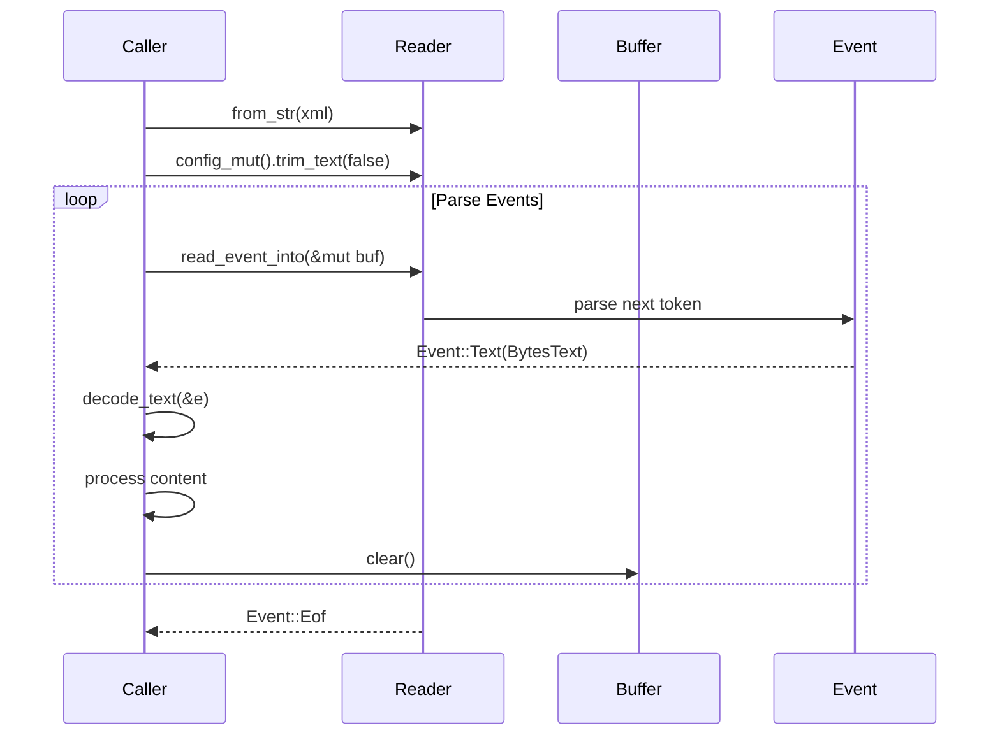

# quick-xml

**Type:** technology

### From: libreoffice_common

quick-xml is a high-performance XML parsing library for Rust, designed to be faster than traditional XML parsers while maintaining correctness and safety. It is a streaming (pull) parser that processes XML documents without building a complete in-memory representation, making it memory-efficient for large documents. The library is particularly well-suited for the types of document processing tasks seen in this module, where we need to extract specific information from potentially large XML files without loading entire document trees into memory.

The design of quick-xml reflects Rust's emphasis on zero-cost abstractions and performance. It uses SIMD-accelerated parsing where available and minimizes allocations during parsing. The library provides both low-level event-based APIs (as used in this module) and higher-level APIs for common use cases. The event-based API returns events like `Start`, `End`, `Text`, `CData`, and `Empty`, allowing fine-grained control over processing. This is essential for the `xml_to_text` function in the module, which needs to recognize specific element types (`p`, `h`, `list-item`, etc.) to insert appropriate formatting while extracting text content.

quick-xml's handling of encoding and its integration with Rust's type system make it particularly appropriate for ODF processing. ODF files are required to be UTF-8 encoded, which simplifies decoding, but the library's flexible handling of byte slices and its `BytesText`, `BytesCData`, and `BytesStart` types provide raw access to parsed data. The module uses `config_mut().trim_text(false)` to preserve whitespace that may be significant, and `config_mut().trim_text(true)` when whitespace can be discarded. Understanding quick-xml's API patterns, particularly the use of temporary buffers that must be cleared between events, is essential for correct implementation of streaming XML processors in Rust.

## Diagram

## External Resources

- [quick-xml Rust crate documentation on docs.rs](https://docs.rs/quick-xml/latest/quick_xml/) - quick-xml Rust crate documentation on docs.rs
- [quick-xml GitHub repository with benchmarks and examples](https://github.com/tafia/quick-xml) - quick-xml GitHub repository with benchmarks and examples
- [quick-xml on lib.rs with usage statistics and alternatives](https://lib.rs/crates/quick-xml) - quick-xml on lib.rs with usage statistics and alternatives

## Sources

- [libreoffice_common](../sources/libreoffice-common.md)

### From: libreoffice_info

quick-xml is a high-performance XML processing library for Rust that emphasizes speed and memory efficiency through a pull-based (streaming) parser design. Unlike DOM parsers that construct entire document trees in memory, quick-xml's reader operates as an iterator over XML events (Start elements, Text content, End elements, etc.), enabling processing of documents significantly larger than available RAM. This architectural choice aligns perfectly with the needs of document metadata extraction, where only specific elements need examination rather than complete document understanding.

The library's implementation in LibreInfoTool demonstrates sophisticated XML processing patterns. The `Reader::from_str` constructor accepts the XML content extracted from ODF ZIP archives, and `config_mut().trim_text(true)` enables whitespace normalization—critical for accurate text content measurement. The event loop pattern using `read_event_into()` with a reusable buffer (`buf.clear()`) minimizes allocations, a performance consideration for high-throughput scenarios. The parser handles namespace-aware local names and attribute extraction, necessary for navigating ODF's XML structure which uses OpenDocument namespaces extensively.

quick-xml's error handling distinguishes between parse errors and I/O errors, though in this context both typically result in graceful degradation (breaking the loop on `Err`). The library's support for both `Event::Start` and `Event::Empty` element variants ensures correct handling of ODF's mixed content model, where elements may be self-closing or have explicit end tags. Its UTF-8 handling assumptions align with ODF specification requirements, though the code includes defensive `from_utf8` conversions with fallback behavior.

### From: libreoffice_read

Quick-XML is a high-performance, streaming XML parser for Rust that enables memory-efficient processing of large XML documents, serving as the core parsing technology for ODT and ODP file handling in LibreReadTool. Unlike DOM-based parsers that load entire documents into memory, quick-xml operates as a pull parser using the StAX (Streaming API for XML) pattern, where the application drives parsing through explicit event reading. This architectural choice is particularly important for document processing where files may be large but only textual content is required, not the full document structure. The implementation in `read_odp()` demonstrates sophisticated event-driven parsing: the `Reader` type is configured with `trim_text(true)` to eliminate whitespace noise, then events are processed in a loop matching `Event::Start`, `Event::Text`, and `Event::End` variants. The parser maintains state through optional `current` string tracking to accumulate slide content across multiple text events, handling the fragmented nature of XML text nodes. The ODP implementation specifically tracks `page` elements (presentation slides) and `p`/`span` elements for paragraph structure, applying intelligent whitespace normalization. Quick-xml's design emphasizes zero-copy parsing where possible, with `local_name()` and `as_ref()` operations providing string slices rather than allocations. The library's error handling uses `Result` types that integrate with Rust's `?` operator, while its `read_event_into()` API with reusable buffers prevents repeated allocations. These characteristics make quick-xml ideal for the agent tool context where predictable memory usage and processing speed are essential for responsive document queries.
