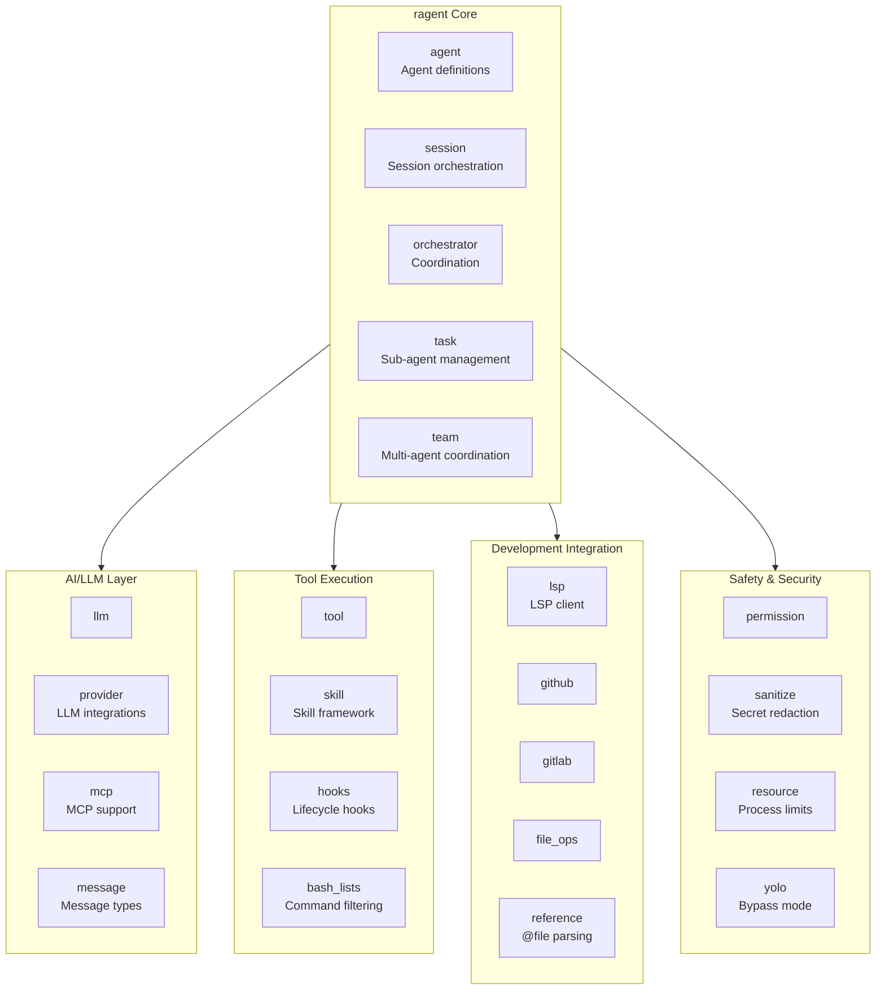

# ragent AI Coding Agent

**Type:** product

### From: lib

ragent is an AI-powered coding agent system designed to assist developers with intelligent code generation, analysis, and manipulation. The system appears to be architected as a modular, extensible platform that can integrate with multiple LLM providers and development tools. Based on the core library structure, ragent supports sophisticated features including sub-agent spawning for parallel task execution, team-based agent coordination with shared resources, and integration with development platforms like GitHub and GitLab. The system implements security-conscious design patterns through permission management, command allowlisting, and input sanitization. The "YOLO mode" feature suggests flexibility for different operational contexts, from strict production environments to rapid development scenarios. The auto-update mechanism indicates this is intended as a deployed tool rather than purely a library, with users receiving binary updates directly from GitHub releases.

The ragent ecosystem appears to follow a specification-driven development approach, as evidenced by references to formal specification sections like "SPEC §3.34" for file reference handling. This suggests the project maintains comprehensive documentation standards and possibly multiple implementation targets. The architecture supports multiple integration patterns including Language Server Protocol for IDE integration, Model Context Protocol for standardized AI tool interactions, and custom skill systems for extensible capabilities. The team coordination features with mailboxes and shared task lists indicate aspirations toward multi-agent collaborative systems where multiple AI instances can work together on complex development tasks.

## Diagram

## External Resources

- [Language Server Protocol specification - LSP integration module suggests IDE compatibility](https://microsoft.github.io/language-server-protocol/) - Language Server Protocol specification - LSP integration module suggests IDE compatibility
- [Model Context Protocol specification - referenced by mcp module](https://spec.modelcontextprotocol.io/) - Model Context Protocol specification - referenced by mcp module

## Sources

- [lib](../sources/lib.md)
