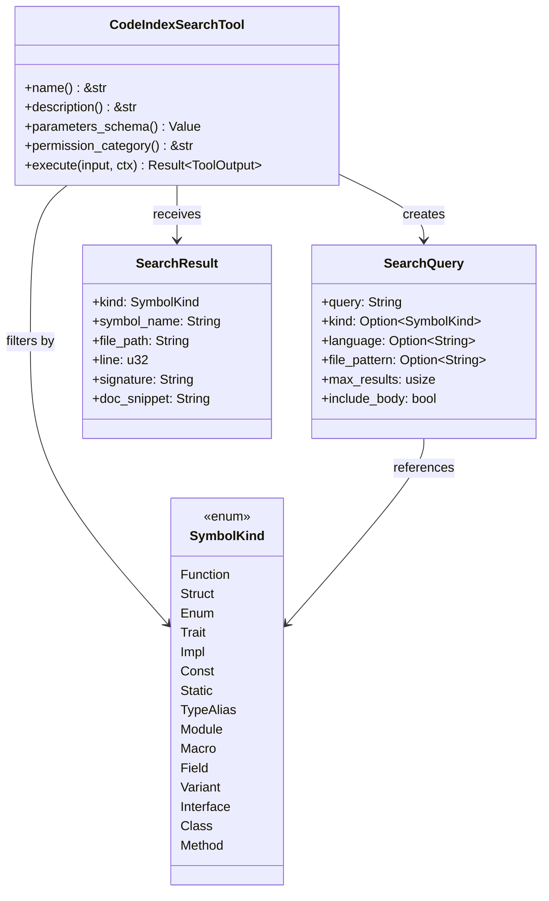

# ragent_code

**Type:** product

### From: codeindex_search

`ragent_code` is a supporting crate in the Ragent ecosystem that provides code analysis and indexing capabilities. While not fully detailed in this source file, its types are referenced extensively: `SymbolKind` for categorizing code entities, `SearchQuery` for structuring search requests, and the code index itself for executing searches. The crate appears to implement a comprehensive code intelligence system similar to language servers or Sourcegraph's indexing infrastructure, capable of parsing multiple programming languages and extracting structured symbol information.

The `SearchQuery` struct defined in `ragent_code` demonstrates sophisticated search capabilities with fields for query strings, symbol kind filtering, language filtering, file pattern matching, and result limiting. The `include_body: false` parameter suggests optional source code retrieval, indicating the index stores or can retrieve full symbol definitions. The `SymbolKind` enum encompasses 15 distinct symbol types spanning Rust (function, struct, enum, trait, impl, const, static, type_alias, module, macro, field, variant) and other languages (interface, class, method), revealing multi-language support ambitions.

The crate's integration with `CodeIndexSearchTool` follows a clean separation of concerns: the tool handles parameter validation, permission checking, and output formatting while `ragent_code` manages the complexities of code parsing, index maintenance, and search execution. This architecture allows the indexing system to evolve independently—potentially adding languages, improving relevance ranking, or changing storage backends—without modifying tool implementations. The `?` operator propagation of `idx.search(&search_query)?` indicates `ragent_code` returns its own error types, likely using `thiserror` or similar for library-appropriate error granularity.

## Diagram

## External Resources

- [rust-analyzer - reference for Rust code indexing approaches](https://github.com/rust-lang/rust-analyzer) - rust-analyzer - reference for Rust code indexing approaches
- [Sourcegraph code intelligence platform](https://about.sourcegraph.com/) - Sourcegraph code intelligence platform
- [Language Server Protocol specification](https://microsoft.github.io/language-server-protocol/) - Language Server Protocol specification

## Sources

- [codeindex_search](../sources/codeindex-search.md)
