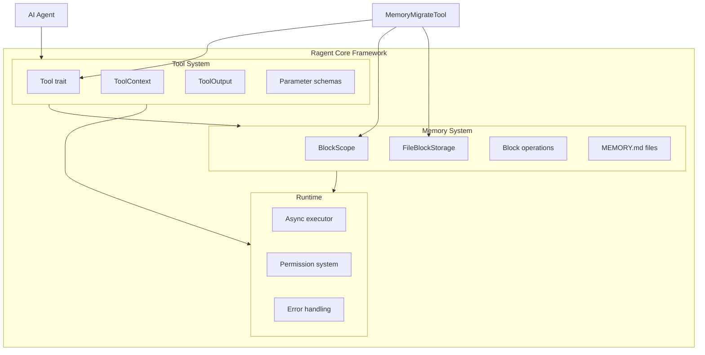

# Ragent Core Framework

**Type:** technology

### From: memory_migrate

Ragent Core constitutes the foundational runtime for an AI agent system implemented in Rust, providing the infrastructure for tool registration, execution, memory management, and context handling. This framework represents a modern approach to agent architecture that leverages Rust's memory safety guarantees and async ecosystem to build reliable, high-performance autonomous systems. The codebase exhibits patterns from established agent frameworks like LangChain, AutoGPT, and Microsoft's Semantic Kernel, while capitalizing on Rust's unique advantages in systems programming and WebAssembly deployment targets.

The tool system architecture revealed in `memory_migrate.rs` demonstrates sophisticated abstraction design: the `Tool` trait defines a contract for capabilities that agents can invoke, with structured parameter schemas enabling automatic validation and UI generation. This pattern enables dynamic tool discovery and composition, where agents can reason about available capabilities and their requirements without hard-coded dependencies. The `ToolContext` provides execution context including working directories and presumably authentication credentials, runtime configuration, and conversation history—mirroring the context objects found in web frameworks and cloud function platforms.

Memory management in ragent-core adopts a hybrid approach that bridges human and machine-optimized formats. The coexistence of flat MEMORY.md files with structured block storage acknowledges the reality that different stakeholders prefer different interfaces: developers may edit markdown directly while agents consume parsed blocks. This polyglot storage strategy requires careful synchronization and migration utilities—exemplified by MemoryMigrateTool—to maintain consistency across representations. The three-tier scope system (user/project/global) further refines this architecture, enabling sophisticated personalization and isolation policies that are essential for multi-tenant agent deployments.

The framework's implementation choices reflect production-hardened engineering practices: `anyhow` for ergonomic error handling that preserves context across call stacks, `serde_json` for schema evolution and interoperability, and `async-trait` for non-blocking I/O that maximizes throughput under concurrent agent workloads. The permission categorization system ("file:write" in this case) suggests integration with capability-based security models that can enforce least-privilege execution, critical for containing potential agent misbehavior. These foundations position ragent-core for enterprise adoption where reliability, observability, and security are non-negotiable requirements.

## Diagram

## External Resources

- [Rust programming language official site](https://www.rust-lang.org/) - Rust programming language official site
- [Tokio async runtime for Rust](https://github.com/tokio-rs/tokio) - Tokio async runtime for Rust
- [LangChain agent framework documentation](https://python.langchain.com/) - LangChain agent framework documentation
- [AutoGPT autonomous agent project](https://github.com/Significant-Gravitas/AutoGPT) - AutoGPT autonomous agent project

## Sources

- [memory_migrate](../sources/memory-migrate.md)

### From: team_assign_task

The ragent-core framework represents a comprehensive Rust-based infrastructure for building autonomous AI agent systems with structured team collaboration capabilities. This framework provides the foundational abstractions for tool definition, agent execution contexts, and inter-agent coordination through well-defined interfaces. The `team_assign_task.rs` file demonstrates the framework's philosophy of explicit, type-safe interfaces that enable both human developers and AI systems to reason about available capabilities through introspectable schemas.

At the architectural center of ragent-core is the `Tool` trait, which standardizes how capabilities are exposed to agents. This trait mandates implementations provide a machine-readable name, human description, JSON Schema parameter specification, permission category, and asynchronous execution logic. The `ToolContext` provides execution-time dependencies including working directory access, enabling tools to locate and manipulate team-specific resources. This design enables dynamic tool discovery and invocation, where orchestration layers can enumerate available tools, validate invocations against schemas, and enforce permission boundaries before execution.

The framework's team subsystem, evidenced by imports from `crate::team`, implements a hierarchical multi-agent organization model. Teams have leads with elevated privileges, members with specific roles, and shared task pools with explicit state machines governing lifecycle transitions. The permission system uses colon-delimited categories like `team:manage` to create granular access control matrices. This architecture supports sophisticated organizational patterns including nested teams, delegated authority, and audit-compliant operation logging through persistent state stores.
