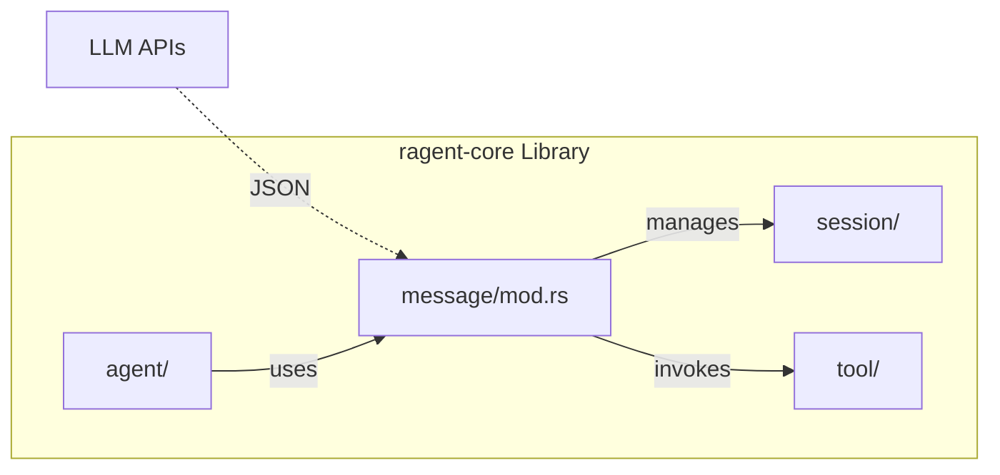

# Ragent-Core Library

**Type:** technology

### From: mod

Ragent-core is a Rust library that provides foundational infrastructure for building AI agent applications. The library focuses on the core abstractions needed for agent operation, particularly conversation management, message serialization, and tool integration. This module represents the message subsystem, which serves as the data layer for all conversation history. The library makes deliberate architectural choices to balance flexibility with type safety, using serde for serialization compatibility with JSON-based LLM APIs while maintaining Rust's ownership and borrowing guarantees. The codebase demonstrates mature Rust practices including comprehensive documentation, example-driven API design, and careful attention to performance characteristics like the decision to store image file paths rather than embedded binary data to keep session databases compact.

## Diagram

## External Resources

- [Serde serialization framework documentation](https://serde.rs/) - Serde serialization framework documentation
- [Chrono date/time library for Rust](https://docs.rs/chrono/latest/chrono/) - Chrono date/time library for Rust

## Sources

- [mod](../sources/mod.md)
