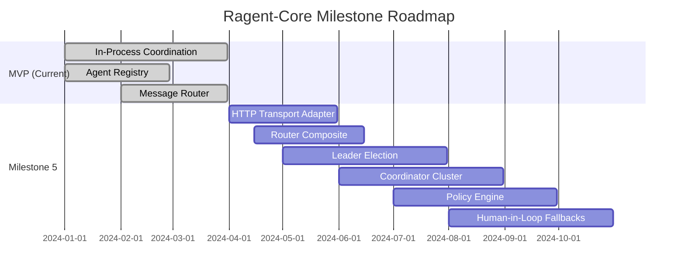

# Ragent-Core Project

**Type:** product

### From: mod

Ragent-Core represents a Rust-based foundational framework for building sophisticated multi-agent artificial intelligence systems, positioning itself in the emerging ecosystem of agentic AI orchestration platforms. The project manifests as a cargo workspace member (`crates/ragent-core`) within a larger system, suggesting enterprise-grade modularization where core orchestration primitives remain separable from domain-specific agent implementations or user-facing interfaces. The codebase demonstrates mature software engineering practices through comprehensive documentation, extensive test coverage, and clear architectural boundaries that anticipate horizontal scaling requirements. By implementing core patterns—registry-based service discovery, capability-based routing, and coordinator-mediated execution—ragent-core provides the infrastructure layer that application developers can leverage without reimplementing distributed systems fundamentals.

The project's documented roadmap through Milestone 5 reveals ambitious scope expansion from its current MVP state toward production-ready capabilities. Planned extensions include pluggable transport adapters enabling HTTP-based communication across network boundaries, leader election mechanisms supporting `CoordinatorCluster` for high-availability deployments, and policy engines integrating human-in-the-loop oversight for sensitive operations. This phased approach reflects lessons from distributed systems development where premature optimization for scale compromises iteration velocity. The current implementation's focus on in-process coordination with clear async/await patterns provides a solid foundation for these extensions, as the same abstractions (AgentRegistry, Router, Coordinator) can transparently accommodate distributed semantics when transport and consensus layers mature.

Ragent-core's technology choices—Rust for memory safety and performance, Tokio for async runtime, and trait-based abstraction for extensibility—position it competitively against Python-heavy alternatives in the AI orchestration space. Rust's compile-time guarantees become particularly valuable in multi-agent systems where agent misbehavior or resource exhaustion must be contained without compromising system stability. The project's module structure (`coordinator`, `leader`, `policy`, `registry`, `router`, `transport`) reveals intentional domain modeling that separates concerns along organizational boundaries typical of enterprise deployments, where different teams might own transport infrastructure versus coordination policies. This architectural clarity suggests ragent-core targets scenarios requiring dozens to thousands of collaborating agents, perhaps in simulation environments, automated research pipelines, or autonomous business process automation where reliability and observability outweigh rapid prototyping convenience.

## Diagram

## External Resources

- [Rust programming language official site for understanding the implementation language](https://www.rust-lang.org/) - Rust programming language official site for understanding the implementation language
- [Tokio async runtime powering ragent-core's concurrent execution model](https://tokio.rs/) - Tokio async runtime powering ragent-core's concurrent execution model
- [Microsoft AutoGen framework for comparison in multi-agent AI orchestration space](https://www.microsoft.com/en-us/research/project/autogen/) - Microsoft AutoGen framework for comparison in multi-agent AI orchestration space
- [LangChain ecosystem for context on agent orchestration patterns in AI development](https://langchain.com/) - LangChain ecosystem for context on agent orchestration patterns in AI development

## Sources

- [mod](../sources/mod.md)
