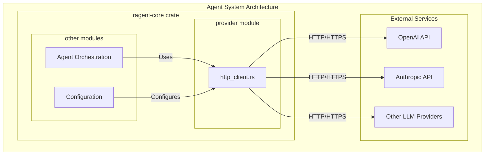

# ragent-core

**Type:** product

### From: http_client

Ragent-core is a Rust crate forming part of a larger agent-based system, specifically designed to support concurrent sub-agent execution with Large Language Model providers. This module (`http_client.rs`) resides within the crate's `provider` submodule, indicating its role in abstracting provider-specific communication concerns. The crate's architecture demonstrates careful attention to production concerns like connection pooling limits, which are explicitly configured to prevent HTTP/2 race conditions that could arise during high-concurrency scenarios typical of agent-based workflows.

The crate's design philosophy emphasizes reliability and observability, as evidenced by integration with the `tracing` crate for structured logging and detailed instrumentation of retry operations. The module documentation explicitly references "concurrent sub-agent execution" as a primary use case, suggesting ragent-core orchestrates multiple LLM-powered agents that may simultaneously communicate with external APIs. This context explains the conservative connection pool limits (8 per host) and the specialized streaming client that can sustain connections for minutes without triggering timeouts. The crate represents a mature approach to building LLM-integrated systems in Rust, balancing performance requirements with the inherent unreliability of network operations and external service dependencies.

## Diagram

## External Resources

- [ragent-core crate on crates.io (if published)](https://crates.io/crates/ragent-core) - ragent-core crate on crates.io (if published)

## Sources

- [http_client](../sources/http-client.md)

### From: ollama

ragent-core is a Rust crate that forms the foundational library for building AI agent applications, providing abstracted interfaces for large language model interactions across multiple providers. The crate implements a provider pattern architecture that decouples application logic from specific LLM service implementations, enabling developers to write provider-agnostic code that can switch between Ollama, OpenAI, Anthropic, and other services through configuration alone. This abstraction proves essential for building resilient agent systems that can fallback between providers or optimize for cost, latency, or capability requirements.

The crate's module structure reveals a thoughtfully layered architecture. The `provider` module defines traits like `Provider` and `ModelInfo` along with shared HTTP client utilities. The `llm` module contains the core chat abstractions including `LlmClient`, message types like `ChatRequest` and `ChatContent`, and content parts supporting multimodal inputs. The `config` module handles capability and cost modeling, while `event` defines streaming event types for real-time response processing. This modularization enables extension without modification—new providers implement existing traits, and new capabilities extend existing enums.

The implementation quality demonstrates production Rust patterns including extensive use of `async_trait` for trait-based async programming, `anyhow` for ergonomic error handling, and `serde` for serialization. The codebase emphasizes zero-cost abstractions where possible, using trait objects (`Box<dyn LlmClient>`) only at provider boundaries while maintaining concrete types internally. Documentation includes runnable examples and comprehensive module-level documentation explaining configuration options. The crate's design philosophy centers on pragmatic flexibility—supporting both streaming and non-streaming responses, local and remote model hosting, simple text and complex tool-calling interactions—while maintaining type safety and compile-time guarantees through Rust's ownership system.

### From: ollama_cloud

ragent-core is a Rust framework for building LLM-powered agents, providing abstractions for model providers, chat interfaces, tool calling, and streaming responses. The codebase follows a modular provider pattern where different LLM services (OpenAI, Anthropic, Ollama, etc.) implement common traits that allow interchangeable usage within agent applications. This architectural approach enables developers to write agent logic once and deploy against multiple backend providers without code changes, supporting scenarios from local development with Ollama to production deployment with managed APIs.

The framework defines core abstractions including the `Provider` trait for provider metadata and client factory methods, and the `LlmClient` trait for actual chat operations. These traits use Rust's async ecosystem with `async-trait` for object-safe async methods, and leverage pinning and boxing for returning dynamically-typed streams. The type system encodes rich information about chat content through enums like `ChatContent` and `ContentPart`, distinguishing between plain text, multipart messages, tool invocations, and tool results. This granularity enables sophisticated agent patterns like tool-augmented generation and multimodal reasoning.

The crate structure visible in this file shows thoughtful organization with modules for configuration (`crate::config`), events (`crate::event`), LLM abstractions (`crate::llm`), and provider implementations (`crate::provider`). The HTTP client functionality is abstracted behind `crate::provider::http_client` with separate methods for standard and streaming clients, likely configuring appropriate timeouts and buffer sizes for each use case. The framework integrates with the broader Rust ecosystem through `anyhow` for error handling, `serde` for serialization, `futures` for stream processing, and `tokio` for async runtime capabilities, demonstrating mature async Rust patterns throughout.

### From: file_lock

ragent-core is the foundational crate within the Ragent project, providing core infrastructure and utilities for building AI-powered agent systems. Based on the file path structure visible in this source document, it appears to be organized as a Rust workspace member under a `crates/` directory, following modern Rust project conventions for multi-crate repositories. The crate contains various submodules handling different aspects of agent functionality, with this particular file residing in a `tool/` subdirectory alongside file manipulation capabilities.

The crate's architecture suggests it serves as the execution engine for agent-based operations, providing primitives that higher-level components build upon. The presence of sophisticated synchronization mechanisms like the file locking system indicates ragent-core handles potentially concurrent operations from multiple agent instances or tool invocations. The `tool/` namespace implies a plugin-like architecture where various capabilities (file editing, presumably others) are organized as discrete modules that can be composed into agent behaviors.

While specific details about the broader Ragent project are limited from this single source file, the implementation quality and patterns used suggest a production-oriented system designed for reliability under concurrent load. The use of async Rust throughout indicates the system is built for I/O-bound workloads typical of agent systems that interact with files, networks, and external services. The crate likely forms part of a larger ecosystem possibly including protocol definitions, agent orchestration, and interface layers for different LLM providers.

### From: bash_reset

ragent-core is a Rust-based framework foundation that provides core infrastructure for building AI agent systems, with particular emphasis on tool execution and session management. The framework implements a modular architecture where capabilities are exposed through discrete tool implementations that adhere to common interfaces, enabling composable and extensible agent behavior. The presence of bash-related tools within this core crate suggests that shell command execution is considered a fundamental capability for agent operation.

The framework's design philosophy emphasizes type safety and explicit error handling through Rust's type system, as evidenced by the use of `anyhow::Result` for operation outcomes and structured JSON schemas for tool parameters. This approach contrasts with more dynamic agent frameworks by providing compile-time guarantees about tool interfaces and execution contracts. The module structure, with tools organized under a `tool` directory and bash-specific functionality further nested, indicates thoughtful separation of concerns and API organization.

ragent-core likely serves as the foundation upon which higher-level agent applications are built, providing primitives for session tracking, working directory management, permission categorization, and tool orchestration. The integration of serde_json for parameter schemas suggests compatibility with JSON-based tool definition standards such as OpenAPI or emerging AI tool specification formats. This positions ragent-core as potentially interoperable with broader ecosystem standards for agent tool definitions.

### From: truncate

The ragent-core crate represents a foundational component of a Rust-based agent framework, providing core utilities and infrastructure for building automated agent systems that interact with tools, process outputs, and manage execution contexts. This crate serves as the engine room for agent operations, encapsulating common concerns like content formatting, output truncation, error handling, and tool result processing that would otherwise be duplicated across agent implementations. The presence of a dedicated `tool` module containing truncation utilities suggests an architecture where agents invoke external tools and need sophisticated output management capabilities—handling potentially voluminous command outputs, log streams, and file contents within reasonable display constraints. The crate's design philosophy emphasizes composability through trait-based interfaces (evidenced by `impl AsRef<str>` parameters) and zero-cost abstractions characteristic of Rust systems programming. By centralizing these utilities, ragent-core enables consistent behavior across diverse agent applications, from code analysis tools to automated DevOps assistants, ensuring that users receive appropriately formatted, readable output regardless of the underlying tool's verbosity. The module structure, with private test modules and public function exports, follows Rust community best practices for maintainable, testable library design.

### From: cancel_task

The `ragent-core` crate constitutes the foundational library of the ragent agent framework, providing core abstractions and implementations for building sophisticated AI agent systems in Rust. This crate likely contains the tool system, session management, task orchestration, and inter-agent communication primitives that higher-level applications build upon. The presence of sub-agent task management capabilities suggests ragent-core targets complex multi-agent scenarios where parent agents delegate work to specialized child agents running in background execution contexts. The framework's design emphasizes type safety through Rust's ownership system, async-first execution for scalable concurrency, and modular architecture through trait-based plugin systems. Such frameworks are positioned in the emerging ecosystem of reliable AI agent infrastructure, competing with Python-based alternatives while offering memory safety and performance advantages for production deployments handling high-throughput agent interactions.

### From: codeindex_symbols

ragent-core is a foundational Rust crate that provides core infrastructure for building AI agents capable of sophisticated code analysis and manipulation. The crate implements a plugin-based tool architecture where capabilities are exposed through trait-based interfaces, enabling modular composition of agent functionality. This architectural approach allows developers to extend agent capabilities by implementing the `Tool` trait, which standardizes how tools declare their identity, describe their purpose, define parameter schemas, specify permission requirements, and execute operations. The crate's design reflects patterns seen in successful AI assistant platforms, prioritizing type safety, asynchronous execution, and structured communication protocols.

The crate's organization suggests a mature approach to software architecture, with clear separation of concerns between tool definitions, execution contexts, and output formatting. The `ToolContext` structure provides a shared context for tool execution, carrying resources like the optional `code_index` that tools may depend upon. This dependency injection pattern enables testability and flexible deployment configurations. The presence of specialized modules for different tool categories—evidenced by the `codeindex_symbols.rs` file location—indicates a thoughtful modular structure that can scale to accommodate diverse agent capabilities ranging from code search and analysis to file manipulation and external API integration.

ragent-core appears to be part of a larger ecosystem, as evidenced by its dependencies on related crates like `ragent_codeindex`, which provides the type definitions for `SymbolKind`, `Visibility`, and `SymbolFilter`. This ecosystem approach allows the core crate to remain focused on tool orchestration and execution while delegating domain-specific concerns to specialized packages. The use of industry-standard Rust crates like `anyhow` for error handling and `serde_json` for serialization demonstrates commitment to ecosystem conventions and developer familiarity. The crate's target use case—powering AI agents that assist with software development—places it within the rapidly evolving domain of AI-assisted programming tools, competing with and potentially interoperating with established platforms like GitHub Copilot, Sourcegraph Cody, and various Language Server Protocol implementations.

### From: gitlab_pipelines

ragent-core is a Rust crate providing foundational components for building AI agent systems with external tool integration capabilities. The crate implements the core abstractions and runtime infrastructure that enable agents to discover, invoke, and manage tools for interacting with external services and APIs. It serves as the engine behind agent-driven workflows where language models can execute real-world operations through structured tool interfaces.

The architecture centers on the Tool trait, which defines the contract that all tool implementations must satisfy. This includes declaring the tool's identity (name), purpose (description), expected parameters (JSON Schema), and permission requirements. Tools are designed to be composable and discoverable, with the crate providing utilities for tool registration, parameter validation, and execution orchestration. The async_trait crate enables asynchronous tool execution, essential for I/O-bound operations like API calls.

The crate demonstrates production-quality Rust patterns including comprehensive error handling with anyhow, JSON manipulation with serde_json, and structured logging. It integrates with platform-specific clients like GitLabClient while maintaining clean separation between tool interfaces and implementation details. The tool system supports metadata-rich outputs that can be consumed by both human users and downstream automation systems, bridging the gap between AI agents and operational infrastructure.

### From: lsp_diagnostics

ragent-core is the foundational framework that hosts the LspDiagnosticsTool and provides the infrastructure for building AI agent tooling systems. As indicated by the source file path `ref:crates/ragent-core/src/tool/lsp_diagnostics.rs`, this crate serves as the central nervous system of a larger agent-oriented architecture, defining the core abstractions and runtime environment within which specialized tools operate. The framework implements a plugin-based tool system where individual capabilities like LSP diagnostics are encapsulated as discrete, composable units that agents can discover and invoke dynamically.

The architecture of ragent-core reflects modern Rust design principles with a strong emphasis on type safety, async execution, and ergonomic error handling. The `Tool` trait that LspDiagnosticsTool implements is defined within this core crate, establishing a uniform interface across all tools including methods for name identification, description retrieval, parameter schema generation, permission categorization, and asynchronous execution. This trait-based design enables polymorphic tool collections, dynamic dispatch, and consistent error propagation patterns that simplify agent implementation. The framework's use of `anyhow` for error handling and `serde_json` for serialization indicates a pragmatic approach to building robust, interoperable systems.

The development of ragent-core represents a response to the growing need for structured tool use in large language model (LLM) applications. As AI agents have evolved from simple chatbots to complex systems capable of performing multi-step tasks, the requirement for well-defined, type-safe interfaces to external capabilities has become critical. Frameworks like ragent-core address this by formalizing the contract between agents and tools, including input validation through JSON Schema, permission-based access control, and standardized output formats. The LSP integration specifically demonstrates how traditional developer tooling can be repurposed for agent consumption.

ragent-core's significance in the broader ecosystem lies in its potential to standardize agent-tool interactions across different AI systems and use cases. By providing a common substrate for tool implementation, it enables code reuse, consistent behavior, and easier integration of new capabilities. The framework's modular crate structure, with separate crates for core functionality and potentially language-specific or domain-specific extensions, suggests a design intended for long-term evolution and community contribution. The presence of LSP support indicates that ragent-core targets software engineering agents specifically, though the underlying patterns could apply to agents in other domains.

### From: team_broadcast

ragent-core represents a foundational framework for building reliable multi-agent systems in Rust, providing primitives for agent lifecycle management, inter-agent communication, and team coordination. The codebase demonstrates a mature approach to agent-oriented programming where autonomous entities collaborate through well-defined protocols and shared abstractions. The framework's architecture emphasizes type safety, composability, and fault tolerance—essential qualities for systems where multiple independent agents must coordinate without centralized control.

The framework organizes functionality into logical modules, with the `tool` subsystem providing extensible capabilities that agents can invoke, and the `team` module handling group dynamics and communication patterns. This modular design supports the creation of domain-specific agent applications while maintaining a consistent operational model. The use of Rust's ownership and borrowing rules ensures that concurrent agent operations remain memory-safe without garbage collection overhead, critical for long-running agent deployments.

ragent-core appears designed for scenarios ranging from automated workflow orchestration to collaborative AI systems where specialized agents contribute distinct capabilities toward shared objectives. The broadcast tool analyzed here exemplifies the framework's approach to collective coordination, enabling emergent behaviors through simple, reliable primitives rather than complex centralized controllers. The integration with filesystem-based persistence (evident in the `TeamStore::load` and `Mailbox::open` calls) suggests deployment flexibility from development environments to containerized production systems.

### From: team_cleanup

ragent-core constitutes the foundational runtime library for the ragent multi-agent orchestration system, providing essential abstractions for agent lifecycle management, inter-agent communication, and team-based organization. As indicated by the module path crate::team, this crate implements domain concepts for collaborative agent groups, distinguishing between individual agent instances and their collective organizational structures. The core library establishes patterns that higher-level applications build upon.

The codebase organization reflects clear architectural separation between generic tool interfaces and domain-specific implementations. The super::{Tool, ToolContext, ToolOutput} import reveals an extensible plugin architecture where capabilities are composed through trait implementations rather than inheritance hierarchies. This design enables orthogonal extension points—new tools can be added without modifying core framework code, while the framework can evolve its execution model independently of specific tool implementations.

The presence of team-scoped operations like team_cleanup alongside presumably complementary tools (team_shutdown_teammate, implied by error messages) suggests a comprehensive management surface for multi-agent systems. This indicates ragent targets scenarios requiring sophisticated coordination: distributed computation workflows, collaborative problem-solving ensembles, or resilient agent collectives with defined membership and lifecycle policies. The crate's responsibilities likely span from low-level process management through high-level team semantics.

### From: team_read_messages

ragent-core constitutes the foundational library crate powering the RAgent multi-agent AI framework, providing essential primitives for agent construction, tool registration, and inter-agent coordination. As a core dependency, this crate establishes architectural conventions and trait contracts that higher-level components build upon, creating a cohesive ecosystem for developing sophisticated AI agent systems. The crate's organization follows Rust best practices for library design, with clear module boundaries separating concerns such as tool definitions, team management, execution contexts, and communication primitives. The presence of a dedicated `tool` module hierarchy indicates a plugin-oriented architecture where capabilities are composed through trait implementations rather than inheritance hierarchies.

The design goals evident in ragent-core prioritize flexibility, type safety, and operational reliability. The pervasive use of serde for serialization enables seamless JSON-based communication with external systems, particularly language model APIs that expect structured tool definitions and outputs. The adoption of anyhow for error handling simplifies error propagation across async boundaries while preserving diagnostic context. The async-trait macro usage suggests the framework targets I/O-bound workloads typical of agent systems that may involve network requests, filesystem operations, and concurrent message processing.

From a systems architecture perspective, ragent-core appears to implement a capability-based security model where tools declare permission categories governing their access to sensitive resources. The `team:communicate` category exemplifies this approach, allowing fine-grained authorization policies that can be evaluated at tool registration time or during execution. This security-conscious design is essential for deployments where agents may handle sensitive data or execute in partially trusted environments. The crate's evolution likely responds to requirements from production multi-agent deployments, incorporating lessons about fault tolerance, observability, and operational debugging.

### From: team_shutdown_ack

ragent-core is a Rust-based framework for building coordinated multi-agent systems, providing foundational infrastructure for agent lifecycle management, inter-agent communication, and team-based task coordination. This codebase represents a sophisticated approach to agent orchestration that balances operational simplicity with robust distributed systems patterns, enabling developers to compose complex agent workflows while maintaining visibility and control over individual agent states.

The architecture of ragent-core reveals several deliberate design decisions reflecting production operational requirements. The tool-based extensibility model, exemplified by TeamShutdownAckTool and its siblings in the tool module, allows dynamic capability injection into agents without recompilation. The state management strategy combines in-memory operational state with filesystem-backed persistence, achieving resilience without external infrastructure dependencies. This makes ragent-core suitable for edge deployments, development environments, and scenarios where minimizing operational complexity is paramount.

The team coordination subsystem, within which TeamShutdownAckTool operates, demonstrates mature patterns for distributed consensus and membership management. By distinguishing between agent identifiers and session identifiers, supporting task assignment tracking, and implementing explicit lifecycle states (evident in MemberStatus::Stopped), ragent-core provides the primitives needed for reliable multi-agent applications. The permission_category mechanism ("team:communicate" in this case) suggests an authorization framework that can enforce capability-based access control across agent operations, critical for security in open multi-agent environments.

### From: team_task_list

ragent-core is the foundational crate of the ragent agent framework, providing core abstractions and implementations for AI agent capabilities, tool systems, and team coordination mechanisms. This Rust-based framework targets developers building autonomous agent systems that can interact with structured data, execute tools, and collaborate through shared state. The codebase organization follows Rust crate conventions with clear module boundaries: the tool submodule contains Tool trait definitions and implementations, while the team module handles collaborative multi-agent primitives including task management and team directory resolution.

The architectural philosophy evident in ragent-core emphasizes composition over inheritance, with the Tool trait serving as the fundamental extension point. Tools are self-describing through schema generation, permission-aware through categorical classification, and executable within asynchronous contexts. This design enables dynamic tool discovery and invocation, critical for LLM-based agents that must reason about available capabilities and construct valid tool calls from natural language intentions. The framework's use of anyhow for error handling and serde_json for data interchange reflects practical prioritization of developer ergonomics and ecosystem interoperability over custom solutions.

The team-oriented features in ragent-core distinguish it from simpler single-agent frameworks. The find_team_dir function and TaskStore abstraction enable multi-agent scenarios where coordination occurs through shared filesystem state rather than direct message passing. This "coordination through data" pattern offers durability, observability, and language-agnostic integration—agents implemented in different stacks can participate in teams by reading and writing the common task format. The permission system (evident in the "team:read" category) suggests enterprise-oriented access control requirements, positioning ragent-core for production deployments with security and compliance considerations.

### From: aiwiki_search

ragent-core is a Rust crate forming the foundational library for building AI agent systems. Based on the module structure revealed in this source file, it provides core abstractions including the `Tool` trait, `ToolContext` for execution environments, and `ToolOutput` for standardized result formats. The crate appears to follow a modular architecture where tools are organized in submodules, with this particular file residing in a `tool` module focused on AIWiki integration capabilities.

The crate's design philosophy emphasizes composability and type safety through Rust's trait system. By defining tools as trait implementations rather than concrete types, ragent-core enables both static dispatch for performance-critical paths and dynamic registration for plugin-style extensibility. The use of anyhow for error handling suggests a preference for ergonomic error propagation over exhaustive error type enumeration, appropriate for application-layer code where error contexts matter more than precise variant matching. The serde_json integration indicates the crate is designed for JSON-heavy workflows typical of LLM-based systems.

The specific location of this file (`crates/ragent-core/src/tool/aiwiki_search.rs`) reveals a workspace structure using Cargo's crate features, where `ragent-core` is one of potentially multiple crates in a unified project. This monorepo approach is common in complex Rust projects, allowing separate versioning and dependency management for core libraries versus application binaries. The presence of AIWiki-specific tooling within the core crate, rather than a separate integration crate, suggests that knowledge base search is considered a fundamental capability for agents built on this framework, not an optional extension.

### From: aiwiki_export

ragent-core is a foundational Rust crate that provides the runtime infrastructure for building intelligent agent systems. The crate implements a sophisticated tool framework that allows agents to discover, register, and execute capabilities dynamically. This architecture follows the plugin pattern where tools are self-describing components that expose metadata about their inputs, outputs, and security requirements through standardized interfaces. The framework emphasizes type safety and async-first design, leveraging Rust's ownership system to prevent common concurrency bugs while maintaining high performance.

The tool system within ragent-core is built around several core abstractions: the `Tool` trait defines the contract that all capabilities must implement, `ToolContext` provides execution environment information including working directories and configuration, and `ToolOutput` structures the response format with both human-readable content and machine-parseable metadata. This dual-output approach enables rich user interfaces while supporting agent autonomy through structured data access. The framework also implements permission categorization, allowing fine-grained access control that administrators can configure according to their security policies.

ragent-core's design reflects modern software engineering practices for AI systems, including comprehensive error handling through the `anyhow` crate, serialization support via `serde_json` for configuration and communication, and async trait support through `async-trait`. The crate serves as the backbone for AIWiki integration, providing the execution context and infrastructure that enables tools like `AiwikiExportTool` to interact with knowledge bases safely and efficiently. The modular architecture allows developers to extend functionality by implementing new tool types without modifying core framework code.

### From: args

Ragent-core is the foundational Rust crate powering the Ragent agent system, providing core functionality for skill definition, invocation, and execution. The crate implements a modular architecture where skills are defined through markdown-based SKILL.md files with YAML frontmatter, enabling declarative configuration of agent capabilities. The `args.rs` module examined here is a critical component of this system, handling the bridge between user input and skill execution by providing robust argument parsing and template substitution. Ragent-core emphasizes type safety, comprehensive testing, and clean separation of concerns, as evidenced by the extensive unit test coverage and clear module boundaries. The crate leverages Rust's ownership and borrowing system to efficiently process strings without unnecessary allocations, using patterns like `String::with_capacity` for pre-allocation and `peekable` iterators for look-ahead parsing.

The skill system architecture treats skills as self-contained units that can accept parameterized input, making the argument substitution mechanism essential for dynamic behavior. Skills can reference arguments multiple times within their bodies, access specific indices, and incorporate runtime context like session IDs and file paths. This design enables reusable, composable agent behaviors that can adapt to varying invocation contexts. The ragent-core crate likely integrates with higher-level components that handle skill discovery, loading, and orchestration, with this module serving as the low-level text processing engine that prepares skill bodies for execution.

### From: wrapper

ragent-core is the foundational crate within the ragent ecosystem, providing essential primitives and infrastructure for building AI-assisted code manipulation tools. The crate's architecture reflects modern Rust best practices, emphasizing type safety, ergonomic async APIs, and clear separation between public interfaces and implementation details. The file operations subsystem, of which `wrapper.rs` is a component, handles one of the most critical and error-prone aspects of code transformation: safely and atomically applying modifications to source files on disk.

The crate's design philosophy prioritizes composability and reliability over convenience at all costs. Each module has a well-defined responsibility, with `wrapper.rs` serving as the gateway between high-level transformation logic and low-level file system primitives. This layering enables sophisticated features like atomic commits, rollback capabilities, and concurrent application of edits across multiple files—capabilities essential for tools that may need to modify hundreds or thousands of files in response to AI-generated suggestions.

ragent-core likely serves as a dependency for higher-level application crates, providing the building blocks upon which user-facing features are constructed. The presence of skill-oriented terminology (like the referenced `/simplify` skill) suggests integration with a command or intent-based interface where users express desired code transformations in natural language or structured commands. The crate's maturity is evidenced by its use of established Rust ecosystem libraries like `anyhow` for error handling and the careful attention to documentation conventions.

### From: yolo

Ragent-core is a foundational crate within the ragent ecosystem, providing core runtime functionality and safety mechanisms for AI agent execution. As suggested by the source file path `ref:crates/ragent-core/src/yolo.rs`, this crate sits at the architectural center of a larger system designed to safely execute AI agent operations, particularly those involving shell commands, tool invocations, and filesystem interactions. The crate's responsibilities appear to include command validation, security policy enforcement, and runtime configuration management.

The presence of YOLO mode specifically indicates that ragent-core implements sophisticated safety layering with multiple defensive mechanisms. The documented bypass categories—bash denied patterns, dynamic context allowlists, and MCP configuration validation—suggest integration with multiple subsystems: a bash execution environment with pattern-based prohibitions, a skill system with contextual permission models, and an MCP (Model Context Protocol) configuration layer with input sanitization. This multi-layered security architecture reflects modern approaches to AI agent safety, where defense in depth prevents single points of failure from compromising system integrity.

The crate's design philosophy balances security with flexibility, providing escape hatches for development scenarios while maintaining strict defaults. The use of Rust for this core infrastructure leverages the language's memory safety guarantees and zero-cost abstractions, ensuring that security-critical code paths are free from certain classes of bugs while maintaining performance suitable for real-time agent interactions. The modular crate structure, with ragent-core as a shared dependency, suggests a larger ecosystem where specialized functionality is separated into focused crates while common primitives and safety mechanisms remain centralized.

### From: embedding

ragent-core is the foundational crate of the ragent system, providing essential memory management and retrieval capabilities for agent-based applications. This Rust library crate implements the persistence and search infrastructure that enables AI agents to maintain long-term context across conversations and sessions. The crate's architecture emphasizes local-first operation, with SQLite as the primary storage backend and optional ONNX Runtime integration for semantic capabilities. By organizing functionality into focused modules like `memory::embedding`, ragent-core maintains clear separation of concerns while providing cohesive APIs for agent developers.

The memory subsystem within ragent-core addresses a critical challenge in LLM-based applications: the limited context window of language models. By implementing persistent storage with both full-text search (FTS5) and semantic vector search, agents can retrieve relevant historical information beyond their immediate context window. This enables more coherent long-running interactions, factual consistency across sessions, and emergent behaviors resembling human-like memory. The crate's design philosophy prioritizes reliability and portability, using pure Rust where possible and carefully gating native dependencies behind feature flags.

The embedding module specifically demonstrates ragent-core's architectural principles through its trait-based abstraction over ML inference. Developers can compile the crate in minimal configurations for resource-constrained environments or enable full semantic search for quality-critical deployments. This flexibility, combined with comprehensive testing and documentation, positions ragent-core as infrastructure for building sophisticated agent systems. The crate integrates with the broader Rust async ecosystem, ensuring that memory operations don't block executor threads and can scale to handle concurrent agent interactions efficiently.

### From: test_agent

Ragent-core is a foundational Rust crate that provides core functionality for an agent-based system, likely designed for AI-powered coding assistance or similar applications. The crate implements agent resolution, configuration management, and agent definition structures that serve as the backbone for building extensible agent behaviors. Based on the test file, it exposes key modules including `agent` for resolution logic and `config` for system configuration management.

The architecture of ragent-core follows modular design principles, separating concerns between agent resolution, configuration, and presumably other core functionalities not shown in this test file. The agent module exposes the `resolve_agent` function, which serves as the primary interface for obtaining agent instances by name. This function returns a Result type, indicating proper Rust error handling practices, though the tests reveal that the system prefers graceful fallback over hard failures for unknown agents.

The crate appears to be part of a larger ecosystem, suggested by the hierarchical naming convention (ragent-core implies additional ragent-* crates may exist). The default configuration system and built-in agent definitions indicate this is a production-ready framework with opinionated defaults for common use cases. The presence of a "general" agent as a built-in option suggests the framework targets general-purpose coding assistance scenarios.

### From: test_config

Ragent Core is a Rust-based framework for building and managing AI agents. It provides foundational infrastructure for agent configuration, execution, and management. The framework supports multiple LLM providers, modular command systems, and experimental features like OpenTelemetry integration for observability. The core crate handles the essential abstractions that higher-level components build upon, including configuration management through structured types that can be deserialized from various formats.

The project follows Rust best practices with comprehensive test coverage for critical functionality. The configuration system demonstrated in these tests shows careful attention to user experience, providing sensible defaults while allowing extensive customization. The merge functionality suggests a layered configuration approach common in mature tools, where system defaults, user preferences, and runtime overrides can coexist without conflict.

Ragent Core appears to be part of a larger ecosystem, with the "ragent-" prefix suggesting multiple related crates. The experimental features flag indicates active development and a willingness to expose cutting-edge capabilities while keeping them opt-in. The framework's design philosophy emphasizes type safety through Rust's ownership system, with configuration validated at deserialization time rather than at runtime.

### From: test_mcp_discovery

The `ragent-core` crate is the foundational library providing core functionality for the ragent agent system, with this test file specifically validating its Model Context Protocol implementation. As a Rust crate, it exposes the `mcp` module containing discovery, client, and server management capabilities that enable seamless integration with the broader MCP ecosystem. The crate's architecture emphasizes type safety, asynchronous execution, and comprehensive error handling characteristic of production-quality Rust systems.

The MCP subsystem within ragent-core implements both client and discovery roles in the protocol, allowing the agent to discover available tool providers (MCP servers) and communicate with them using standardized JSON-RPC messaging. The discovery module, tested in this file, provides automated scanning capabilities that eliminate manual configuration burden while maintaining security through the default-disabled policy. This balances convenience with caution in a system where discovered executables will be invoked with potentially significant privileges.

The crate's design follows Rust's ownership and borrowing rules to ensure memory safety without garbage collection overhead, making it suitable for long-running agent processes. The async/await patterns employed in the discovery tests indicate integration with Tokio or another Rust async runtime, enabling non-blocking I/O during filesystem scans and potential network operations. The comprehensive test coverage demonstrated in this file reflects the crate's production orientation, with tests serving both as verification and as executable documentation of expected behaviors and security properties.

### From: test_message

Ragent Core is a foundational library crate that provides essential abstractions and implementations for building agent-based systems in Rust. As indicated by the module path `ragent_core::message`, this crate serves as the central dependency for message handling primitives that enable communication between autonomous software agents. The crate likely implements a structured messaging protocol that supports various message types, roles (such as User, Assistant, and System), and session management capabilities. The presence of comprehensive unit tests within the crate suggests a focus on reliability and correctness, which are critical requirements for agent coordination systems where message integrity directly impacts system behavior.

The architecture of ragent-core appears to follow Rust best practices with clear module boundaries, as evidenced by the dedicated `message` submodule that encapsulates message-related functionality. The crate's design emphasizes type safety through Rust's ownership system and enum variants like `MessagePart`, which allow for extensible message content while maintaining compile-time guarantees about message structure. The integration with `serde` for serialization indicates that the crate is intended for production use cases requiring persistence, network communication, or integration with external systems. This positions ragent-core as potentially part of a larger ecosystem for building conversational AI agents, autonomous workflows, or distributed actor systems.

### From: test_message_types

RAgent Core is a Rust library that provides foundational messaging infrastructure for building AI agent systems. The library implements a sophisticated message type system designed to handle the complex requirements of conversational AI applications, particularly those involving tool use and multi-modal content. The core architecture centers around the Message type, which serves as the primary unit of communication between users and AI assistants, supporting heterogeneous content through a multi-part design pattern.

The library's design reflects modern patterns in AI system architecture, where agents must seamlessly blend natural language generation with computational actions. The message system explicitly models different content types including plain text for direct communication, reasoning steps for transparent AI thinking processes, and tool calls for external system interactions. This type-safe approach using Rust's enum and struct system provides compile-time guarantees about message structure while maintaining flexibility for diverse content combinations.

RAgent Core also implements comprehensive state management for tool invocations through the ToolCallState structure, capturing the full lifecycle from pending through running, completed, or error states. This includes timing metrics, structured JSON inputs and outputs, and detailed error information essential for debugging and observability. The library's serialization support via serde enables persistence and network transmission, making it suitable for distributed agent systems and conversation history management.
