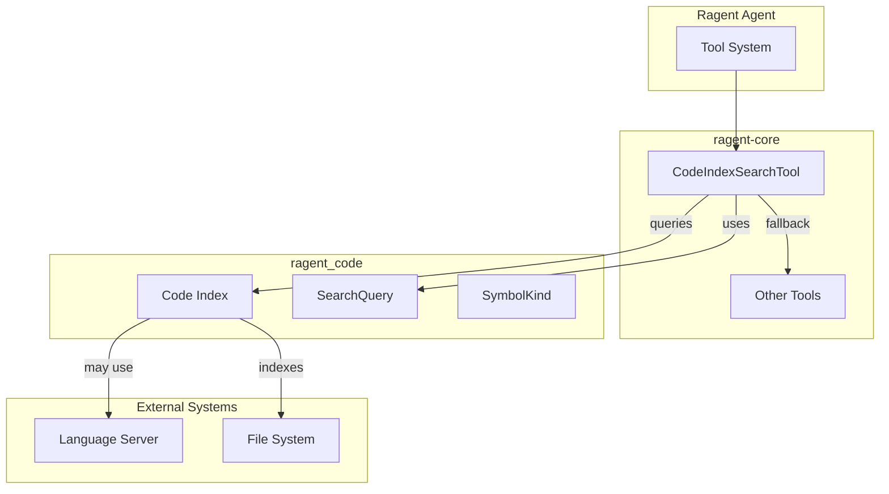

# Ragent Project

**Type:** product

### From: codeindex_search

Ragent is an agent framework designed for software engineering tasks, providing structured tool systems for code analysis, search, and manipulation. The project appears to be organized as a Rust workspace with multiple crates, including `ragent-core` for foundational tool implementations and `ragent_code` for code analysis capabilities. The framework follows a modular architecture where tools implement a common `Tool` trait, enabling consistent parameter validation, execution, and permission management across diverse capabilities. The codebase demonstrates production-quality Rust patterns including async/await, trait-based abstraction, and comprehensive error handling.

The Ragent framework's tool system represents a sophisticated approach to AI agent capabilities, where each tool is self-describing through JSON Schema definitions. This enables runtime discovery and validation of tool parameters, crucial for reliable agent behavior. The `CodeIndexSearchTool` exemplifies this philosophy, providing not just search functionality but detailed guidance on when to use it versus alternatives. The project's integration with language server protocol (LSP) concepts and symbol indexing suggests it targets professional software development workflows, competing with or complementing tools like GitHub Copilot, Sourcegraph, or IDE-integrated AI assistants.

The implementation reveals careful attention to developer experience and system reliability. The graceful handling of unavailable indexes, detailed tool descriptions guiding appropriate usage, and structured output formatting all indicate a mature approach to building developer tooling. The permission system (`codeindex:read`) suggests enterprise or multi-tenant deployment scenarios where tool access needs to be controlled. Ragent's architecture appears designed for extensibility, with clear patterns for adding new tools and integrating with external code analysis systems.

## Diagram

## External Resources

- [Rust Async Programming - underlying async trait patterns used](https://rust-lang.github.io/async-book/) - Rust Async Programming - underlying async trait patterns used
- [Serde serialization framework documentation](https://serde.rs/) - Serde serialization framework documentation
- [JSON Schema standard for parameter validation](https://json-schema.org/) - JSON Schema standard for parameter validation

## Sources

- [codeindex_search](../sources/codeindex-search.md)

### From: team_idle

Ragent appears to be a Rust-based framework for building multi-agent AI systems, with ragent-core representing its foundational crate providing essential primitives for agent coordination, task management, and team orchestration. The project embodies a philosophy of explicit, protocol-driven agent interaction rather than implicit coordination through shared memory or message passing alone. This approach addresses fundamental challenges in distributed AI systems: ensuring agents maintain consistent world models, preventing resource conflicts, and providing observability into collective decision-making processes. The codebase demonstrates production-quality Rust patterns including comprehensive error handling with `anyhow`, structured logging through metadata propagation, and async/await for non-blocking I/O operations.

The architectural revealed through `team_idle.rs` suggests ragent positions itself as infrastructure for 'team-based' AI applications—scenarios where multiple specialized AI agents collaborate on complex workflows rather than monolithic models handling all aspects. This mirrors organizational structures in human enterprises: teams with leads, members with assigned responsibilities, status tracking, and escalation procedures. The framework provides persistence through file-based stores (`TaskStore`, `TeamStore`) rather than requiring external databases, lowering deployment complexity while maintaining durability guarantees through atomic write patterns implied by the `save()` method calls.

The project's technical sophistication extends to its extension mechanisms, particularly the hook system that allows custom logic injection at critical workflow points. This balances framework rigidity (enforcing safe state transitions) with application flexibility (custom business rules). The use of JSON Schema for parameter validation (`parameters_schema` method) indicates API-first design suitable for language-agnostic integration, while the permission category system (`team:communicate`) hints at enterprise security requirements. Ragent likely targets developers building autonomous systems, automated DevOps pipelines, research multi-agent simulations, or complex content generation workflows requiring decomposition across specialized AI workers.

### From: client

Ragent is a Rust-based agent or automation tool that integrates with GitHub's API to provide repository management, code analysis, or development workflow automation capabilities. The project structure, as evidenced by the `ragent-core` crate organization, follows Rust conventions with clear separation between authentication concerns (`github/auth`), client implementation (`github/client`), and presumably higher-level business logic. The codebase demonstrates production-quality Rust patterns including comprehensive error handling, async/await for concurrency, and careful management of external service credentials. The GitHub OAuth integration suggests Ragent operates as a GitHub App or OAuth application, requiring user authorization to act on their behalf.

The architecture revealed in this source file suggests Ragent targets developers and development teams seeking programmatic access to GitHub functionality. The repository detection feature (`detect_repo`) indicates tight integration with local git workflows, automatically inferring context from the developer's current working directory. This design choice reduces friction for command-line usage, allowing users to invoke Ragent commands without explicitly specifying repository coordinates. The OAuth device flow support, evidenced by the client ID management and authentication prompt messages, enables secure authentication on machines without browsers or with restricted access, such as remote servers or containers.

The project's naming and structure hint at broader ambitions beyond simple GitHub API wrapping. The "agent" terminology suggests autonomous or semi-autonomous operation, potentially including scheduled tasks, event-driven responses, or AI-powered code analysis. The core crate organization implies extensibility, with GitHub integration serving as one of potentially multiple service integrations. Configuration management through both environment variables (`RAGENT_GITHUB_CLIENT_ID`) and TOML configuration files (`~/.ragent/config.toml`) demonstrates flexibility for different deployment scenarios, from local development to containerized production environments. The version identifier "ragent/0.1" in the User-Agent header confirms early-stage development with room for feature expansion.

### From: journal

Ragent is an agent framework project that provides the broader context for the `journal.rs` memory system, representing a Rust-based infrastructure for building autonomous or semi-autonomous software agents with structured observability and learning capabilities. The journal module exists within `ragent-core`, the foundational crate of the project, suggesting an architecture organized around core abstractions with potential extension points for domain-specific agent implementations. The project name appears explicitly in test code as a sample project value (`with_project("ragent")`), indicating this is an active, self-dogfooding codebase where the framework developers use their own tooling to track development insights and patterns.

The design priorities evident in `journal.rs`—type safety, performance, immutability, and comprehensive testing—reflect the Rust ecosystem's emphasis on zero-cost abstractions and reliability, positioning Ragent as a production-oriented framework rather than experimental research code. The integration of mature crates like `serde` for serialization, `chrono` for time handling, and `uuid` for identifier generation demonstrates adherence to community standards and interoperability concerns, while the SQLite-based persistence with FTS5 search indicates deployment flexibility ranging from embedded single-agent scenarios to multi-agent shared knowledge bases. The session and project identifiers in journal entries suggest Ragent supports multi-tenancy and context isolation, essential for agent systems that may operate across different tasks, environments, or organizational boundaries.

The append-only journal philosophy implemented here aligns with emerging practices in AI observability and explainability, where comprehensive logging of agent reasoning steps becomes critical for debugging, auditing, and iterative improvement of agent behavior. By capturing not just final decisions but the contextual insights that led to them, Ragent's memory system enables post-hoc analysis of agent cognition, potentially supporting reinforcement learning from human feedback, case-based reasoning, and knowledge transfer between agent instances. The framework's modular structure, with memory functionality separated into its own crate and file, suggests a composable architecture where journaling can be integrated with planning, perception, and action modules to form complete agent pipelines.
