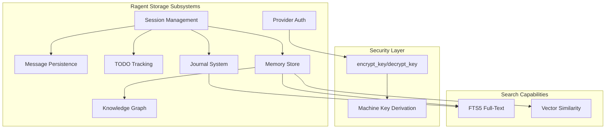

# Ragent Storage

**Type:** product

### From: mod

Ragent Storage is the core persistence subsystem of the ragent AI agent framework, providing comprehensive data management capabilities for conversational AI applications. As implemented in the Storage struct, this product component manages the complete lifecycle of agent-related data including conversation sessions with versioning and archival support, multi-part messages with role-based attribution, provider API credentials with machine-bound encryption, task management through TODO items, reflective journaling with semantic search, and structured memory with vector embedding support. The design philosophy emphasizes local-first architecture where all data resides in a single SQLite database file, enabling portability and privacy while supporting advanced features like full-text search and semantic similarity retrieval.

The product distinguishes itself through security-conscious credential management, implementing a two-generation encryption scheme. Version 1 used simple XOR obfuscation with a fixed key, while version 2 employs BLAKE3-derived machine-specific keys with random nonces, providing meaningful protection against credential theft while maintaining usability. The memory subsystem represents a particularly sophisticated feature, supporting categorization of learned information into types like facts, patterns, preferences, insights, errors, and workflows, with confidence scoring and access tracking to enable intelligent forgetting and prioritization. Integration with external embedding models enables cosine similarity search over memories, supporting retrieval-augmented generation patterns where relevant context is dynamically retrieved based on semantic relevance.

## Diagram

## External Resources

- [Ragent framework GitHub repository (inferred)](https://github.com/bosun-ai/ragent) - Ragent framework GitHub repository (inferred)
- [ragent-core crate documentation](https://docs.rs/ragent-core/latest/ragent_core/) - ragent-core crate documentation

## Sources

- [mod](../sources/mod.md)
