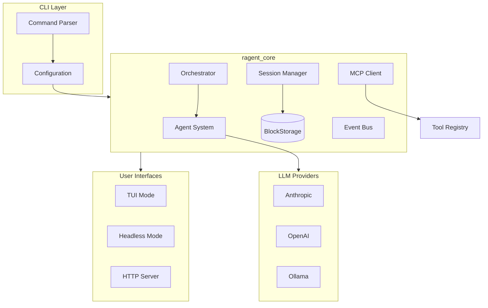

# ragent

**Type:** product

### From: main

ragent is a terminal-based AI coding agent implemented in Rust, designed to provide intelligent code assistance directly within the developer's command-line environment. The product distinguishes itself through its multi-modal architecture supporting both interactive TUI and headless execution, comprehensive session persistence, and extensible tool integration via the Model Context Protocol (MCP). The codebase demonstrates mature software engineering practices with comprehensive error handling using anyhow, structured logging via tracing, and careful separation of concerns across multiple internal crates (ragent_core, ragent_tui, ragent_server).

The product's architecture centers around a session-based interaction model where conversations are persisted to SQLite storage with full import/export capabilities. ragent supports multiple LLM providers through a registry pattern, allowing users to switch between Anthropic Claude, OpenAI GPT models, and local Ollama instances. The permission system enables granular control over potentially dangerous operations, while the optional TUI provides real-time log streaming and rich interaction capabilities. The orchestration subsystem enables complex multi-agent workflows where specialized agents can collaborate on tasks based on capability matching.

From a deployment perspective, ragent can operate as a standalone CLI tool, an interactive terminal application, or a networked HTTP server with authentication. The server mode includes rate limiting infrastructure and coordinator-based job distribution, suggesting design for team or enterprise scenarios. Memory management features allow export and import of structured knowledge across sessions and even external tools like Cline and Claude Code, positioning ragent as a hub in a broader AI-assisted development ecosystem.

## Diagram

## External Resources

- [Rust programming language official repository](https://github.com/rust-lang/rust) - Rust programming language official repository
- [Tokio async runtime documentation](https://docs.rs/tokio/latest/tokio/) - Tokio async runtime documentation
- [clap command line argument parser](https://docs.rs/clap/latest/clap/) - clap command line argument parser
- [tracing structured logging framework](https://docs.rs/tracing/latest/tracing/) - tracing structured logging framework
- [Model Context Protocol specification](https://modelcontextprotocol.io/) - Model Context Protocol specification

## Sources

- [main](../sources/main.md)

### From: oasf

Ragent is an AI agent runtime system that implements the OASF specification for agent configuration and execution. The project appears to be developed in Rust, emphasizing type safety and performance for agentic workflows. The codebase structure suggests a modular architecture with clear separation between core agent functionality and standardized schema compliance.

The ragent system introduces several implementation-specific extensions to the base OASF specification, most notably the `ragent/agent/v1` module type that carries runtime configuration parameters. These extensions address practical concerns for LLM-based agent execution including prompt templating with variables like `{{WORKING_DIR}}` and `{{FILE_TREE}}`, temperature and sampling controls, model provider binding syntax, and a permission system for tool access governance. The architecture supports multiple execution modes (primary, subagent, or all) enabling composition patterns where agents can delegate to specialized sub-agents.

A distinctive feature of the ragent implementation is its permission rule system defined in `RagentPermissionRule`, which provides fine-grained access control over tool categories including filesystem operations (read, edit), shell execution (bash), network access (web), and planning operations (plan_enter, plan_exit). The glob pattern matching system allows administrators to constrain agent capabilities based on file paths, supporting security policies that limit destructive operations to specific directories or require interactive confirmation for sensitive actions. The memory scoping feature (user, project, or none) indicates support for persistent agent state across sessions.

### From: mcp_tool

ragent is a Rust-based agent framework designed for building sophisticated AI agents with modular tool systems. The framework provides the foundational infrastructure for agent operation, including tool discovery, invocation, permission management, and execution context handling. At its core, ragent defines the `Tool` trait—a fundamental abstraction that standardizes how capabilities are exposed to agents, regardless of whether those capabilities are built-in functions, external service calls, or protocol-mediated operations like MCP tools.

The architecture of ragent emphasizes composability and type safety through Rust's trait system. The `Tool` trait requires implementations to provide metadata (name, description, parameter schema) and execution logic, enabling the framework to present a uniform interface to agent reasoning components. This design supports both static tool definitions known at compile time and dynamic tool discovery at runtime, as demonstrated by the `McpToolWrapper` integration. The trait-based approach also facilitates testing through mock implementations and enables sophisticated features like tool chaining and result transformation.

the ragent-core crate, where `mcp_tool.rs` resides, contains the essential agent functionality without application-specific logic. This crate manages the lifecycle of tool execution, handles asynchronous operations through Tokio, and provides serialization support via Serde. The framework's use of `anyhow::Result` for error handling reflects a pragmatic approach to operational errors in agent systems, where diverse failure modes from external tools must be propagated without losing diagnostic information. The `ToolOutput` struct returned by tool execution captures both content and optional metadata, supporting extensible result formats that can accommodate everything from simple text responses to structured data with provenance information.

### From: aliases

Ragent is an AI agent framework written in Rust, designed to enable autonomous coding assistants and software development agents. The project implements a modular tool system where agents can invoke various capabilities like file operations, code search, shell execution, and user interaction through a well-defined trait-based interface. The framework emphasizes security through permission categorization, robustness through comprehensive error handling with anyhow, and interoperability through JSON-based parameter schemas compatible with LLM function calling conventions.

The architecture separates concerns between canonical tool implementations and compatibility layers, as demonstrated by the aliases module. This separation allows the core system to maintain clean, principled APIs while still accommodating the messy reality of LLM output variations. Ragent draws inspiration from and aims to be compatible with multiple existing agent frameworks, including OpenAI's Agents SDK, Claude Code, and other coding assistant systems. The project uses modern Rust async patterns with async-trait for ergonomic trait-based async execution.

The tool system in ragent is designed around the core `Tool` trait, which specifies methods for name, description, parameter schema (JSON Schema format), permission category, and async execution. This design enables both static tool registration and dynamic tool discovery, making it suitable for building flexible agent systems that can adapt to different tasks and environments. The permission category system (`file:read`, `file:write`, `bash:execute`) provides a foundation for implementing least-privilege security models in autonomous agents.

### From: codeindex_dependencies

Ragent is an AI agent framework written in Rust, as evidenced by the crate structure and module organization visible in this source file. The framework appears to follow a modular architecture with a core crate (`ragent-core`) and supporting crates for code analysis (`ragent-code`), suggesting a design that separates general agent infrastructure from domain-specific capabilities. The framework enables the construction of autonomous or semi-autonomous software agents capable of performing complex tasks including code understanding, navigation, and manipulation. The code reveals sophisticated engineering patterns including trait-based abstractions for extensible tool systems, structured context passing for maintaining agent state, and integration with modern Rust async ecosystems. The `ragent_code` crate specifically provides types and functionality for code analysis, including the `DepDirection` enum and `CodeIndex` abstraction that powers dependency queries.

The Ragent framework's tool system demonstrates a well-architected plugin model where capabilities are encapsulated as discrete, composable units implementing a common `Tool` trait. This design enables dynamic tool registration, unified parameter validation through JSON schemas, and consistent output formatting across diverse capabilities ranging from file system operations to semantic code queries. The framework places significant emphasis on reliability and observability, as shown by the comprehensive error handling, structured logging through metadata fields, and graceful degradation when optional components like the code index are unavailable. The permission system with categories like 'codeindex:read' suggests enterprise-ready access control suitable for deployment in sensitive environments.

Ragent appears to target the growing market of AI-powered developer tools and autonomous coding agents, competing with frameworks like AutoGPT, LangChain's agent implementations, and specialized coding agents like GitHub Copilot's agent mode. Its Rust implementation offers advantages in performance, memory safety, and deployment flexibility compared to Python-based alternatives, potentially enabling lower-latency responses and more efficient resource utilization in production deployments. The codebase index integration represents a particularly sophisticated capability, moving beyond simple text retrieval to structured understanding of code relationships that enables more intelligent agent behavior. The framework's design philosophy emphasizes composability, type safety, and operational robustness—hallmarks of production-grade Rust software engineering applied to the emerging domain of AI agent systems.

### From: lsp_hover

Ragent appears to be a framework or platform for building autonomous agent systems with integrated development capabilities, as evidenced by the `ragent-core` crate structure and the `ragent.json` configuration file referenced in the source code. The project implements a modular tool system where capabilities are exposed through a common `Tool` trait, enabling composition of complex agent behaviors from reusable, permission-scoped components. This architecture suggests ragent is designed for scenarios where large language models need safe, controlled access to external systems like language servers, filesystems, and potentially other tools.

The codebase demonstrates production-quality Rust patterns including structured error handling with anyhow, asynchronous trait objects through async_trait, and careful resource management. The `ragent.json` configuration system mentioned in error messages indicates a declarative approach to agent setup, where users configure available LSP servers and other capabilities rather than hardcoding them. This design philosophy prioritizes flexibility and security, allowing administrators to precisely control what resources an agent can access through permission categories like the `"lsp:read"` classification used by this hover tool.

The tool system architecture suggests ragent targets use cases in automated software engineering, intelligent code assistance, or autonomous development workflows. By wrapping LSP functionality in a tool interface, ragent enables LLMs to programmatically access code intelligence that would normally require human interaction with an IDE. This positions ragent within the emerging ecosystem of AI-powered development tools, competing conceptually with GitHub Copilot's agentic features, Cursor's composer, and similar systems that blur the line between conversational AI and traditional development environments.

### From: webfetch

ragent is an AI agent framework implemented in Rust, as evidenced by the crate structure and user agent string in the WebFetchTool source. The codebase follows a modular architecture with a `ragent-core` crate containing foundational components and a `tool` module providing capabilities that agents can invoke. The version 0.1 designation indicates early development stage, while the GitHub reference suggests open-source distribution under the thawkins organization.

The architecture centers on a `Tool` trait abstraction that enables dynamic capability discovery and execution. Tools implement standardized methods for name, description, parameter schema (JSON Schema format), permission category, and execution logic. This design supports agent systems that can reason about available capabilities, validate parameters against schemas, and invoke tools with appropriate permissions. The `ToolOutput` struct provides a consistent return format with content and optional metadata, enabling agents to process results uniformly regardless of the specific tool invoked.

WebFetchTool's "web" permission category suggests a security model where tools are grouped by risk level or resource access type. This categorization could support permission elevation, sandboxing, or user confirmation requirements for potentially dangerous operations. The tool system appears designed for integration with language models through JSON Schema parameter definitions, enabling automatic generation of tool descriptions for model context windows. The overall design reflects modern agent framework patterns seen in systems like LangChain, AutoGPT, and OpenAI's function calling, adapted to Rust's type safety and performance characteristics.

### From: bundled

Ragent is an AI-powered software development agent framework written in Rust, designed to assist developers with code review, refactoring, debugging, and automation tasks. The system operates through a modular skill-based architecture where capabilities are encapsulated in discrete, composable units called skills. Ragent distinguishes itself through its priority-based skill scoping mechanism, allowing skills to be defined at bundled (built-in), personal (user), and project levels, with higher-priority scopes overriding lower ones. This enables customization while providing sensible defaults.

The framework implements a sophisticated tool permission system where each skill declares exactly which tools it may invoke—such as bash for shell commands, read for file access, edit for modifications, grep for searching, and glob for pattern matching. This least-privilege approach enhances security and predictability. Ragent also differentiates between user-invoked and model-invoked skills, with certain operations like large-scale batch changes requiring explicit human initiation. The system is designed for integration with modern development workflows, providing commands that mirror common developer needs: reviewing recent changes, applying transformations across codebases, troubleshooting sessions, and running scheduled tasks.

### From: loader

Ragent is an AI agent framework that provides a structured skill system for defining reusable agent behaviors and capabilities. The framework enables developers to create skills as markdown files with YAML frontmatter, allowing for declarative configuration of agent behavior, tool permissions, execution contexts, and invocation rules. Ragent implements a hierarchical skill discovery mechanism that supports both local project-specific skills and globally shared skills, with built-in compatibility for the OpenSkills specification promoted by Anthropic. The framework emphasizes security through explicit tool allowlisting, supports forked execution contexts for isolated agent operations, and provides granular control over whether skills can be invoked by users, the model, or both. Ragent's skill system is designed to be extensible, with support for hooks, dynamic context injection, and custom metadata fields.

### From: resolve

Ragent is a Rust-based agent framework or tool suite designed to enhance LLM interactions through reference-aware prompt processing. Based on the code structure and naming conventions, ragent appears to provide core infrastructure for resolving `@` prefixed references in user prompts, enabling LLMs to access external knowledge from local files, directories, and web URLs. The core crate (`ragent-core`) implements the fundamental resolution pipeline with support for multiple document formats including plain text, Microsoft Office formats, PDFs, and web content. The architecture suggests a modular design with separate crates for core functionality, tool implementations, and potentially CLI or server interfaces. The user agent string "ragent/0.1" indicates an early development version, suggesting active evolution toward a comprehensive agent development platform. Such tools are increasingly important in the LLM ecosystem, bridging the gap between conversational AI and structured data access patterns.

### From: cross_project

Ragent is an intelligent agent framework written in Rust, designed to provide memory-augmented capabilities for software development workflows. The framework implements a structured memory system that enables agents to persist and retrieve contextual information across sessions, with sophisticated scoping mechanisms that balance global knowledge sharing against project isolation. Ragent's architecture emphasizes modularity through its crate structure, with `ragent-core` providing foundational abstractions and `ragent-cli` or similar crates likely handling user-facing interfaces. The memory system demonstrated in this file represents a core differentiator for Ragent, addressing the cold-start problem common in LLM-based agents by maintaining durable, queryable context.

The framework's design reflects lessons from earlier agent systems and developer tooling ecosystems. By storing global memory in `~/.ragent/memory/`, Ragent follows Unix conventions for application data while enabling cross-project knowledge accumulation. The configuration system uses JSON-based settings that can be committed to version control or kept in user-specific locations, supporting both team-standardized and personal customization workflows. Ragent's approach to memory shadowing and precedence rules mirrors package manager behaviors, making it intuitive for developers familiar with dependency resolution concepts. The choice of Rust for implementation provides memory safety and performance characteristics essential for agent systems that may process large context windows and frequent storage operations.

### From: client

Ragent is a Rust-based software agent system designed to provide intelligent automation capabilities for software development workflows, specifically targeting integration with popular code hosting platforms like GitHub and GitLab. The project represents a modern approach to developer tooling, combining Rust's performance and safety guarantees with async runtime capabilities for responsive, non-blocking operation. The codebase follows modular architecture principles with clear separation between platform-specific adapters (github, gitlab modules) and core abstractions for storage, authentication, and HTTP transport layers.

The ragent-core crate serves as the foundational library, implementing platform clients, configuration management, and credential resolution with support for multiple backends. The system's design emphasizes composability and testability, with dependency injection patterns enabling flexible storage implementations and mock-based testing. The GitLab client module specifically demonstrates ragent's architectural philosophy: abstracting platform complexity behind ergonomic Rust APIs while maintaining full access to underlying platform capabilities. The layered credential resolution system (environment variables → configuration files → database) reflects real-world deployment scenarios where secrets management and configuration flexibility are critical requirements.

Ragent's technology choices reveal its target use cases: the reqwest HTTP client provides robust async HTTP handling with connection pooling and TLS support; serde_json enables zero-copy JSON parsing with strong typing; and anyhow offers ergonomic error handling without boilerplate. The slash-command style configuration interfaces (`/gitlab setup`) suggest integration with chat-based developer workflows, possibly as a bot or IDE extension. The project's structure anticipates extension to additional platforms and capabilities, with the mirror pattern between GitHub and GitLab clients establishing conventions for future platform adapters.
