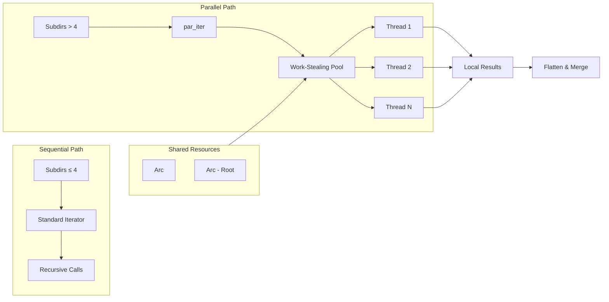

# Rayon

**Type:** technology

### From: glob

Rayon is a data parallelism library for Rust that enables painless parallelization of sequential code through ergonomic iterator adapters. Within the GlobTool implementation, Rayon serves as the critical performance optimization layer that transforms potentially latency-intensive directory traversals into parallel operations. The library's `par_iter()` method is strategically employed when the number of subdirectories exceeds four, a heuristic that balances parallelization overhead against potential speedup gains. This threshold reflects empirical understanding of parallel computing tradeoffs, where spawning threads for minimal work can actually degrade performance due to synchronization costs and cache effects. Rayon's design philosophy centers on "data parallelism"—dividing data across threads rather than spawning threads per task—which aligns naturally with directory tree structures where independent subtrees can be processed concurrently. The library guarantees deterministic result ordering for operations like `collect()`, which is important for GlobTool's consistent output formatting, though the tool explicitly sorts results to ensure platform-independent ordering. Rayon's integration with Rust's ownership system through `Arc` (atomic reference counting) enables safe sharing of the glob matcher across threads without data races. The library's work-stealing scheduler automatically distributes tasks across available CPU cores, adapting to heterogeneous directory structures where some branches may be deeper or more populated than others. This adaptive scheduling proves particularly valuable when traversing real-world codebases with irregular directory layouts.

## Diagram

## External Resources

- [Rayon GitHub repository - data parallelism library for Rust](https://github.com/rayon-rs/rayon) - Rayon GitHub repository - data parallelism library for Rust
- [ParallelIterator trait documentation - core Rayon abstraction](https://docs.rs/rayon/latest/rayon/iter/trait.ParallelIterator.html) - ParallelIterator trait documentation - core Rayon abstraction

## Sources

- [glob](../sources/glob.md)
