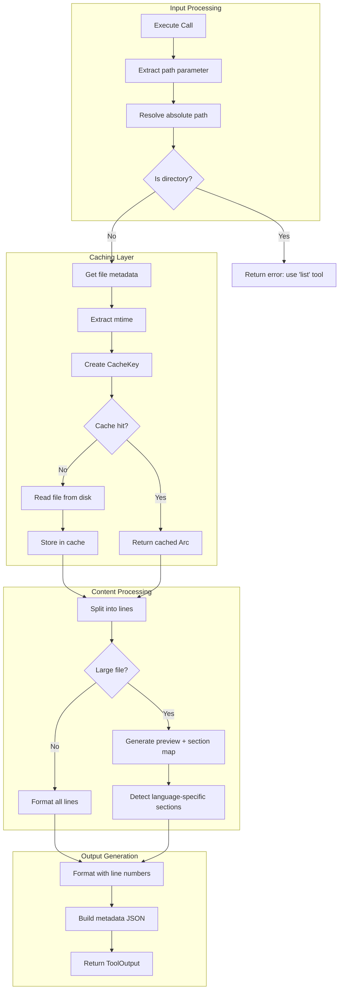

# ReadTool

**Type:** technology

### From: read

ReadTool is a core component of the ragent-core toolkit that provides intelligent file reading capabilities specifically designed for AI agent workflows. Unlike conventional file readers, ReadTool is architected to handle the unique challenges of agent-based interactions, where files may be accessed repeatedly during a single session and where large files need to be consumed in manageable chunks. The tool implements a sophisticated caching layer using a process-wide LRU (Least Recently Used) cache that stores up to 256 file entries, keyed by both absolute path and last-modified timestamp to ensure cache coherence. This design decision reflects a deep understanding of agent behavior patterns, where the same configuration files, source code, or documentation may be referenced multiple times during complex multi-step operations.

The structural awareness capabilities of ReadTool represent a significant advancement over naive file reading utilities. When encountering large files (defined as those exceeding 100 lines), the tool automatically generates a section map that identifies logical boundaries within the file based on its detected language. This section detection supports twelve different programming languages and file formats including Rust, Python, JavaScript/TypeScript, Markdown, TOML, YAML, C/C++, Java, Go, Ruby, CSS, and INI files. Each language has its own tailored detection logic that recognizes function definitions, class declarations, struct definitions, module boundaries, and other structural elements. For instance, Rust detection identifies pub fn, async fn, struct, enum, impl blocks, and macro_rules definitions, while Python detection focuses on def and class statements. This multi-language support enables agents to navigate complex codebases efficiently, requesting specific sections rather than loading entire files into context.

The output formatting of ReadTool emphasizes human readability while maintaining machine parseability. All lines are prefixed with 1-based line numbers in a fixed-width format, making it easy for both humans and agents to reference specific locations. The tool supports optional line range parameters (start_line and end_line) that allow precise access to file subsets, with careful validation to ensure requested ranges fall within actual file bounds. When validation fails, the tool provides descriptive error messages that guide users toward valid inputs. The integration with anyhow for error handling ensures that all failures are captured with rich context, including file paths and operation descriptions that aid debugging. Asynchronous execution via tokio ensures that file I/O operations don't block the executor, critical for maintaining responsiveness in multi-tool agent workflows.

## Diagram

## External Resources

- [Tokio asynchronous filesystem API documentation](https://docs.rs/tokio/latest/tokio/fs/) - Tokio asynchronous filesystem API documentation
- [LRU cache crate documentation for Rust](https://docs.rs/lru/latest/lru/) - LRU cache crate documentation for Rust
- [Anyhow error handling library documentation](https://docs.rs/anyhow/latest/anyhow/) - Anyhow error handling library documentation

## Sources

- [read](../sources/read.md)
