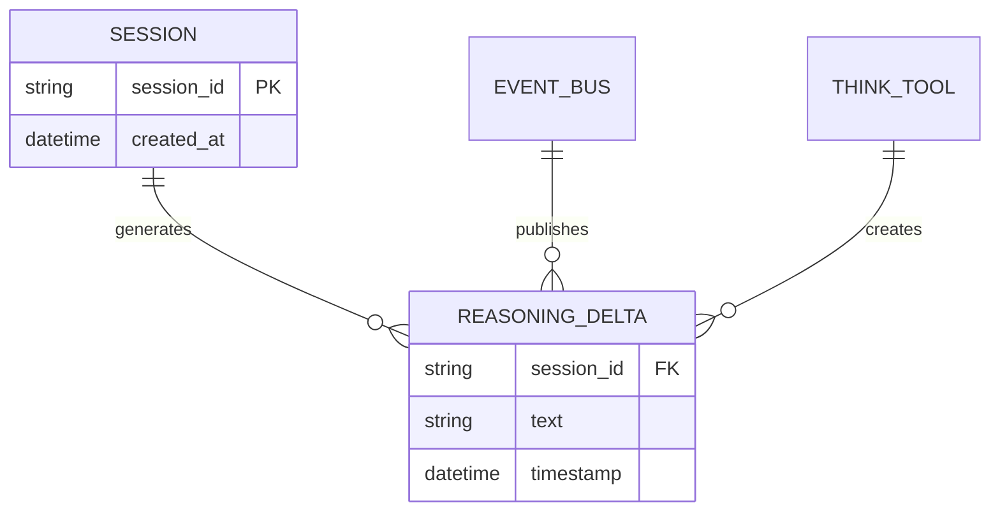

# ReasoningDelta

**Type:** technology

### From: think

ReasoningDelta is an event type variant within the ragent-core event system that carries reasoning note data from tools to observers. As a structured event variant, it combines two critical pieces of context: the session identifier that enables correlation of reasoning across multiple tool invocations, and the actual text content of the reasoning note. This design pattern reflects an event-sourcing approach to agent observability, where the complete history of an agent's operation can be reconstructed by replaying events in sequence.

The Delta suffix in the name suggests that ReasoningDelta represents an incremental update rather than a complete state replacement, implying that a session accumulates multiple reasoning notes over its lifetime. This incremental model is particularly valuable for long-running agent sessions where reasoning evolves through multiple planning phases, hypothesis generations, or self-correction cycles. The use of structured events rather than simple logging enables type-safe consumption by downstream processors, supporting use cases like automated reasoning analysis, cognitive pattern detection, or integration with ML feedback systems.

In the broader ecosystem of AI observability, event types like ReasoningDelta parallel concepts found in OpenTelemetry's event model, LangSmith's trace spans, and Anthropic's Claude thinking blocks. The explicit session_id field addresses a common challenge in distributed agent systems: maintaining causal relationships across asynchronous operations. By including the session identifier in every event, the system enables reconstruction of per-session reasoning chains even when events are processed by stateless consumers or stored in time-ordered logs that interleave multiple sessions.

## Diagram

## External Resources

- [OpenTelemetry tracing and events specification](https://opentelemetry.io/docs/concepts/signals/traces/) - OpenTelemetry tracing and events specification
- [Anthropic's extended thinking and reasoning documentation](https://docs.anthropic.com/en/docs/build-with-claude/extended-thinking) - Anthropic's extended thinking and reasoning documentation

## Sources

- [think](../sources/think.md)
