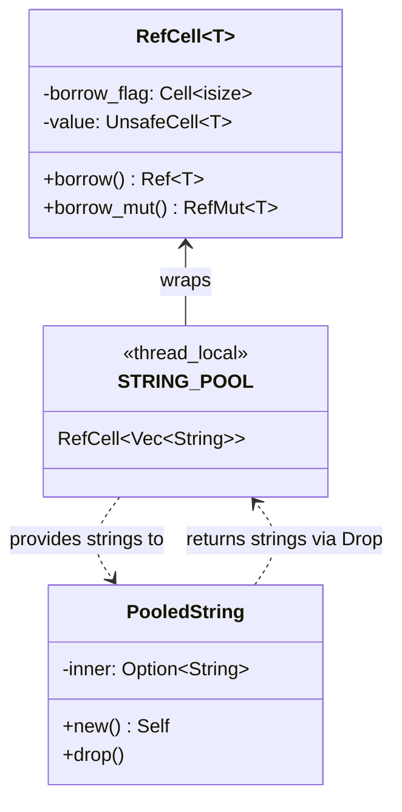

# RefCell

**Type:** technology

### From: pool

RefCell is a fundamental component of the thread-local pooling implementation, providing interior mutability for the pool storage. In Rust, the borrow checker normally enforces that mutable references are exclusive and immutable references can coexist, but this checking happens at compile time. RefCell moves this checking to runtime, allowing mutable borrows of data even when the RefCell itself is accessed through an immutable reference. This is essential for the STRING_POOL implementation because `thread_local!` provides thread-local storage that is accessed through a closure-based API (`with(|pool| ...)`), where the pool reference passed to the closure is effectively immutable. Without RefCell, it would be impossible to mutate the Vec<String> containing pooled strings. The module uses `RefCell::borrow_mut()` when popping strings from the pool and `RefCell::borrow()` when checking statistics. This design choice accepts a small runtime cost (the borrow flag check) in exchange for flexible, safe mutability patterns that would otherwise require more complex synchronization primitives. The runtime checking provides panic-on-violation semantics rather than data races, maintaining Rust's safety guarantees. For the message pooling use case, where operations are brief and contention is eliminated by thread-locality, this overhead is negligible compared to the cost of heap allocation.

## Diagram

## External Resources

- [Rust RefCell documentation for interior mutability](https://doc.rust-lang.org/std/cell/struct.RefCell.html) - Rust RefCell documentation for interior mutability
- [Rust Cell types documentation explaining interior mutability patterns](https://doc.rust-lang.org/std/cell/index.html) - Rust Cell types documentation explaining interior mutability patterns

## Sources

- [pool](../sources/pool.md)
